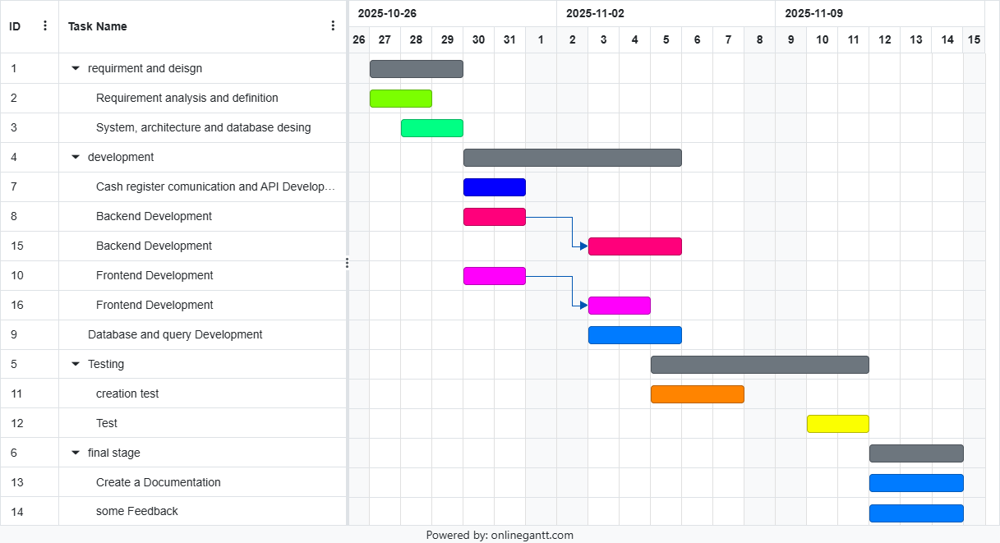

# Project Estimation

Date: 13/11/25

Version: 1.0

# Estimation approach

Consider the EZShop project as described in your requirements document, assume that you are going to develop the project INDEPENDENT of the deadlines of the course, and from scratch

# Estimate by size

###

|                                                                                                         | Estimate |
| ------------------------------------------------------------------------------------------------------- | -------- |
| NC = Estimated number of classes to be developed                                                        |     9    |
| A = Estimated average size per class, in LOC                                                            |     600     |
| S = Estimated size of project, in LOC (= NC \* A)                                                       |      5400    |
| E = Estimated effort, in person hours (here use productivity 10 LOC per person hour)                    |    540 ph     |
| C = Estimated cost, in euro (here use 1 person hour cost = 30 euro)                                     |    16,200.00 €    |
| Estimated calendar time, in calendar weeks (Assume team of 5 people, 8 hours per day, 5 days per week ) |    ~3 week     |

# Estimate by product decomposition

###

| component name       | Estimated effort (person hours) |
| -------------------- | ------------------------------- |
| Requirement document |                25                 |
| Design document      |                  25               |
| code                 |                 100                |
| code test            |                   30              |
| api and comunication test |               70                  |
| Menagment documents |                    25             |
|   total | 275 |

# Estimate by activity decomposition + Gantt chart

###
step 1: activities (WBS), step 2 Gantt chart
| Activity name | Estimated effort (person hours) |
| ------------- | ------------------------------- |
| Requirement analysis and definition | 15 |
| System, architecture and database desing | 20 |
| Cash register comunication and API Development| 25 |
| Backend Development | 70 |
| Database and query Development| 50 |
| Frontend Development | 30 |
| Testing | 100 |
| Create a Documentation | 15 |
| Sundry Feedback | 20 |
| Total| 345 |

###

## Gantt chart

# Summary

Report here the results of the three estimation approaches. The estimates may differ. Discuss here the possible reasons for the difference

|                                    | Estimated effort (ph) | Estimated duration (calendar time, relative)|
| ---------------------------------- | ---------------- | ------------------ |
| estimate by size                   |          540        |         ~3 weeks           |
| estimate by product decomposition  |          275        |         ~2 weeks           |
| estimate by activity decomposition (Gantt) |    345      |             3 weeks       |
