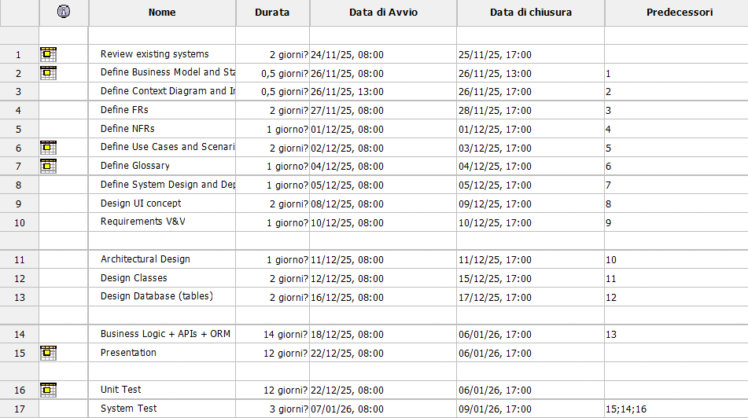
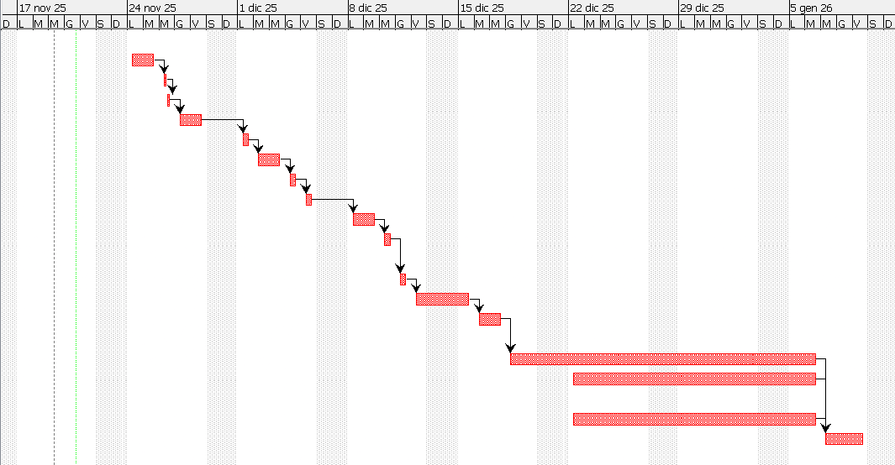

# Project Estimation

Date: 24/11/2025

Version: 1.0.0

# Estimation approach

Consider the EZShop project as described in your requirements document, assume that you are going to develop the project INDEPENDENT of the deadlines of the course, and from scratch

# Estimate by size

###

|                                                                                                         | Estimate |
| ------------------------------------------------------------------------------------------------------- | -------- |
| NC = Estimated number of classes to be developed                                                        |15        |
| A = Estimated average size per class, in LOC                                                            |350       |
| S = Estimated size of project, in LOC (= NC \* A)                                                       |15 * 350 = 5250 LOC|
| E = Estimated effort, in person hours (here use productivity 10 LOC per person hour)                    |5250 / 10 = 525 ph|
| C = Estimated cost, in euro (here use 1 person hour cost = 30 euro)                                     |525 * 30 =  15750 euro|
| Estimated calendar time, in calendar weeks (Assume team of 5 people, 8 hours per day, 5 days per week ) |525 ph (E) / 200 ph (5 people * 8 hours per day * 5 days per week) = 2,625 calendar weeks|

# Estimate by product decomposition

###

| component name       | Estimated effort (person hours) |
| -------------------- | ------------------------------- |
| requirement document | 45 ph                           |
| design document      | 45 ph                           |
| implementation       | 550 ph                          |
| unit tests           | 85 ph                           |
| system tests         | 25 ph                           |
| total                | 750 ph                          |

Estimated duration: (calendar time)
Assuming team of 5 people, 8 hours per day, 5 days per week,

750 ph / 200 ph = 3,75 calendar weeks

# Estimate by activity decomposition + Gantt chart

###
step 1: activities (WBS), step 2 Gantt chart
| Activity name | Estimated effort (person hours) |
| ------------- | ------------------------------- |
| 1. Requirements  | 80                              |
| review existing systems| 10                     |
| define business model | 5                       |
| define context diagram and interface | 5        |
| define FRs    | 15                              |
| define NFRs   | 5                               |
| define use cases and scenarios | 10             |
| define gloassary | 5                            |
| define system design and deployment | 10        |
| design UI concept | 10                          |
| requirement v&v | 5                             |
| 2. Design | 80                                     |
| architectural design | 20                       |
| class design | 20                               |
| database design (tables) | 10                   |
| APIs design | 20                                |
| design v&v | 10                                 |
| 3. Implementation | 900                            |
| business logic + APIs + ORM | 600               |
| presentation | 300                              |
| 4. Testing | 340                                   |
| unit test | 220                                 |
| system test | 120                               |

###

## Gantt chart

Estimated duration: (calendar time) 7 calendar weeks

# Summary

Report here the results of the three estimation approaches. The estimates may differ. Discuss here the possible reasons for the difference

|                                    | Estimated effort (ph) | Estimated duration (calendar time, relative)|
| ---------------------------------- | ---------------- | ------------------ |
| estimate by size                   | 525              | 2,625              |
| estimate by product decomposition  | 750              | 3,75               |
| estimate by activity decomposition (Gantt) | 1400     | 7                  |

The three estimation approaches yield significantly different results due to the scope and assumptions inherent in each method. 
The size-based estimate approach relies on lines of code and productivity metrics, focusing primarily on implementation. It does not account for non-coding activities such as requirements analysis, design, and testing, making it overly optimistic.
Product decomposition incorporates major development phases, including documentation and testing. However, it assumes ideal parallel execution and minimal overhead, which may not reflect real-world conditions.
The activity-based estimate, which includes detailed WBS and scheduling constraints, provides the most comprehensive view, considering detailed work breakdown, task dependencies, and realistic scheduling constraints. It is therefore the most reliable estimate for planning purposes.
Given the complexity of the EZShop project and the need for coordination, quality assurance, and risk management, the activity-based estimate should be adopted as the baseline. A professional team of five members should plan for approximately 1,400 person-hours over 7 calendar weeks, with an estimated cost of €42,000 (based on €30 per person-hour). This estimate aligns with industry practices and ensures sufficient time for all phases of development.
