# Graphical User Interface Prototype

A working prototype of the application is available [here](https://www.figma.com/proto/TPi309x18cWVdN2yDg17lP/EZShop?node-id=2-2043&p=f&t=Z5b6PkTScvesCZXz-0&scaling=contain&content-scaling=fixed&page-id=0%3A1&starting-point-node-id=2%3A2043). You will need a figma account to try it out. If there is any problem you can contact me at amedeo.marino@studenti.polito.it.

## Authentication

The first time the end user opens EZShop he will be prompted to login with his account or create one if he hasn't one:

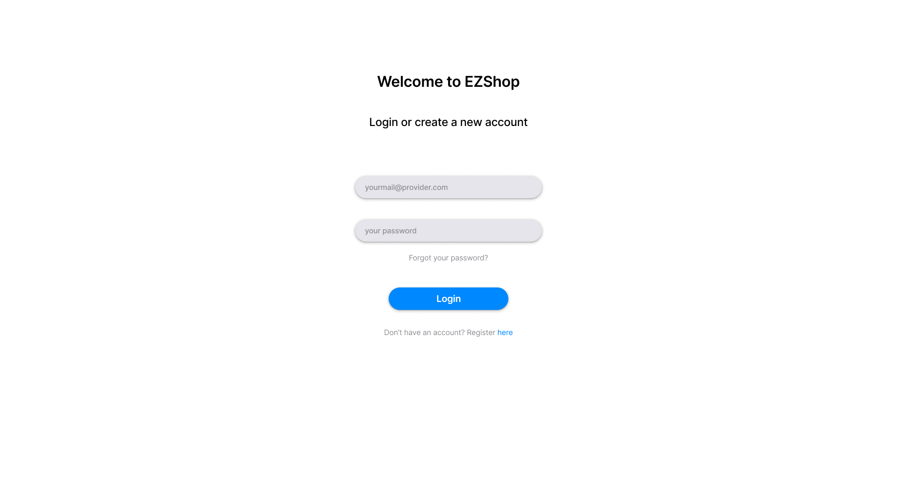

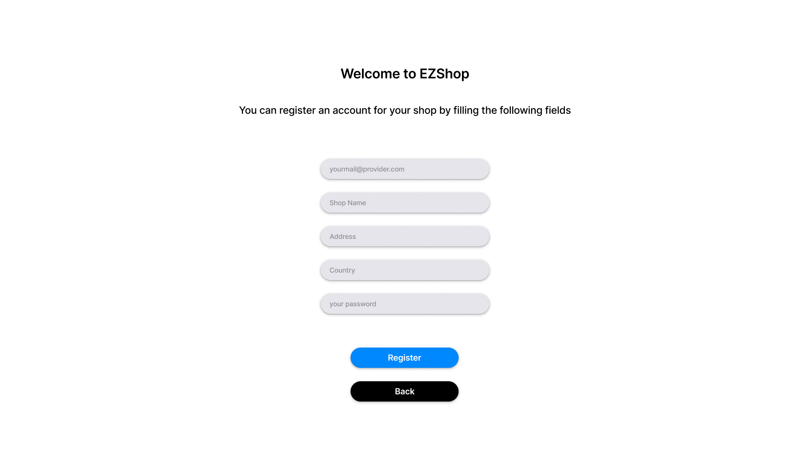

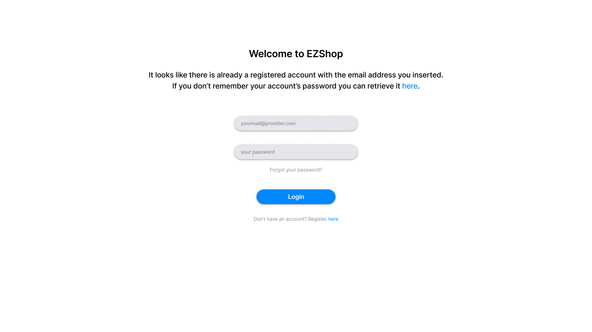

Whenever the end user succesfully fills in the credentials of his account, he will be redirected to the 2 factor authentication process, where a temporary code will be sent to the email address used in the account registration:

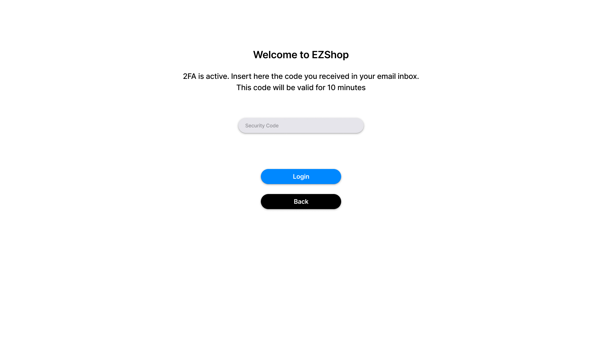

If the current account has no ongoing subscription, the end user will be prompted to pay the monthly fee to gain access to EZShop:

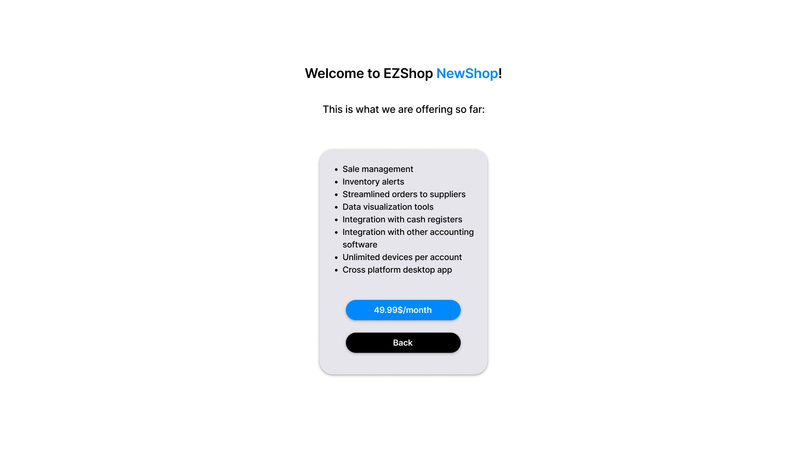

## Overview

Once the login process has been completed, the first screen showed is the `Overview` section:

Here the end user has access to general overview about the shop, some general data about today's sales, ongoing orders and inventory alerts. On the left the end user can freely move between EZShop's tabs and eventually logout from the program.

## Sales

In the `Sales` tab the end user can read, search, sort, edit and add sales records:

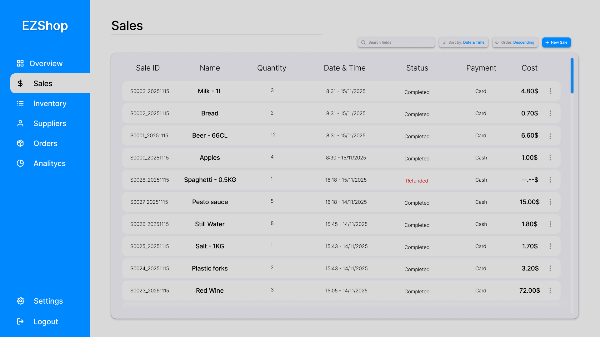

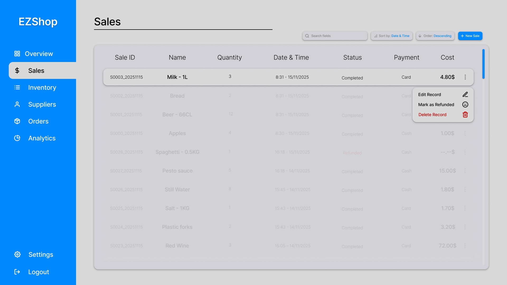

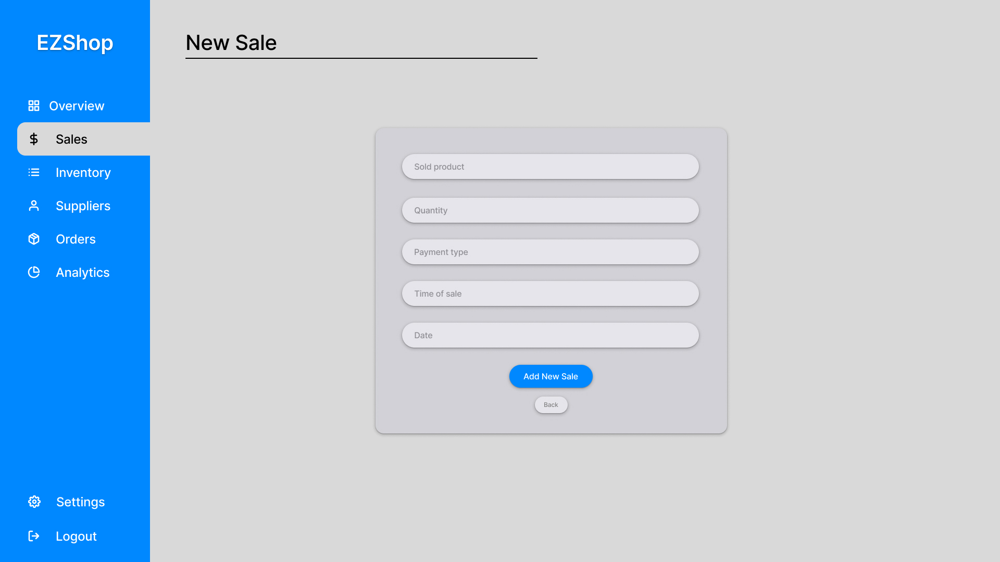

## Inventory

In the `Inventory` tab the end user can read, search, sort, edit and add inventory records:

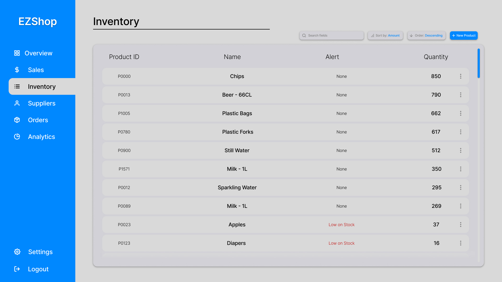

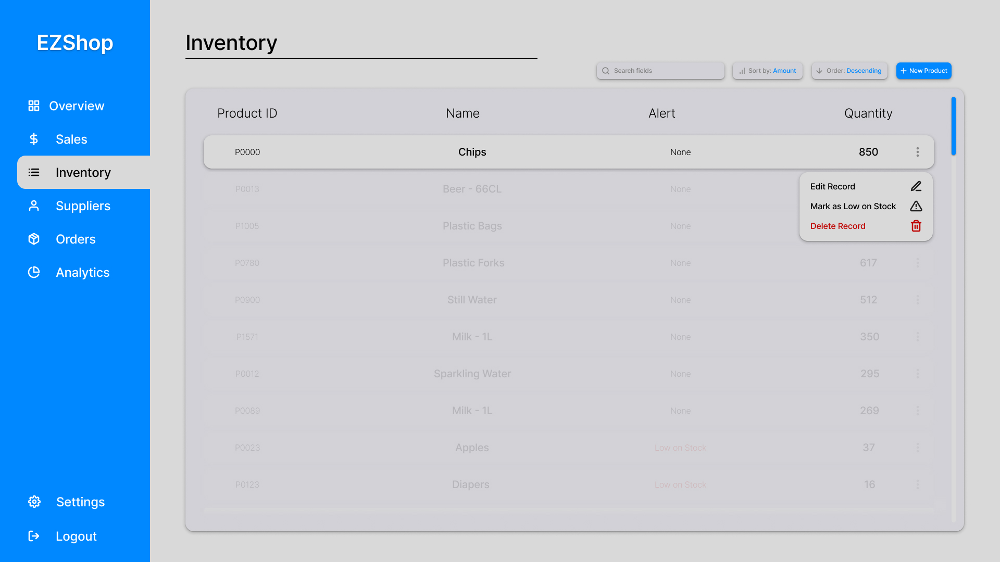

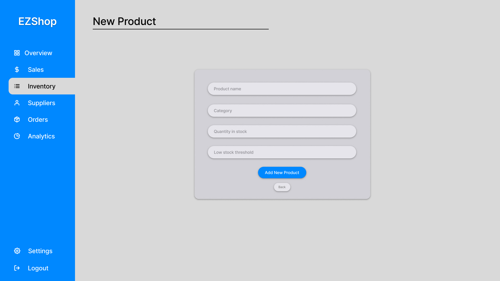

## Suppliers

In the `Suppliers` tab the end user can read, search, edit and add inventory records:

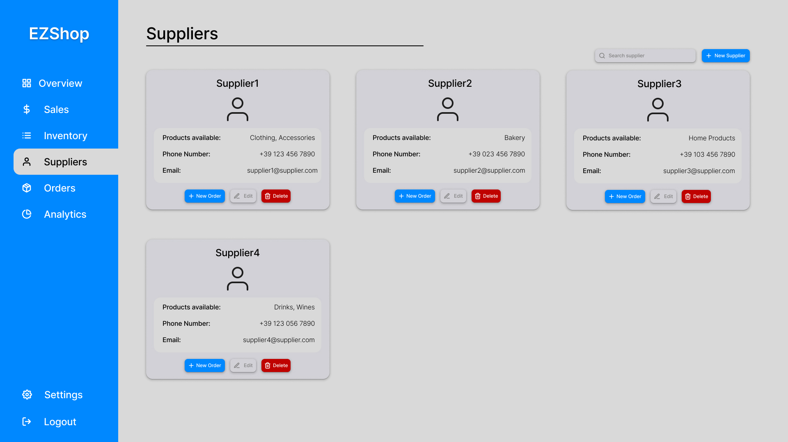

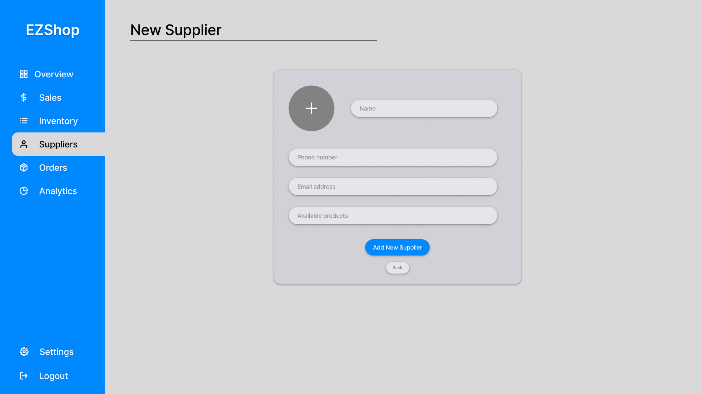

## Orders

In the `Orders` tab the end user can read, search, edit and add order records:

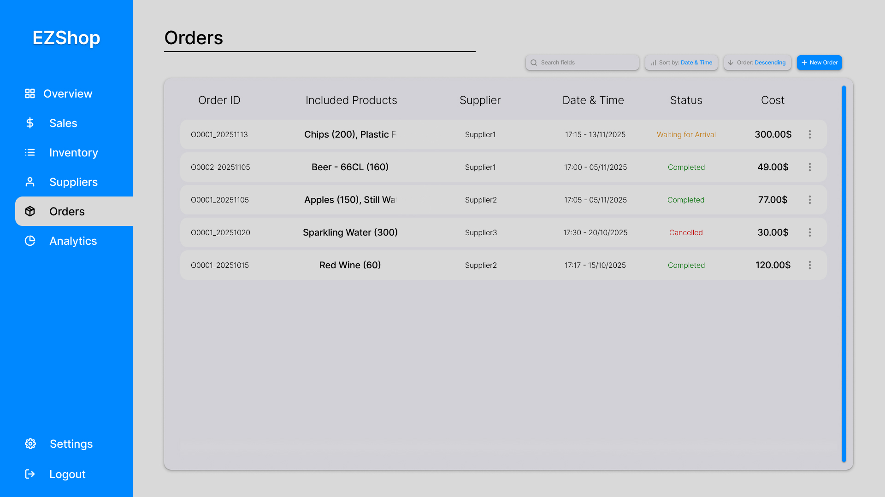

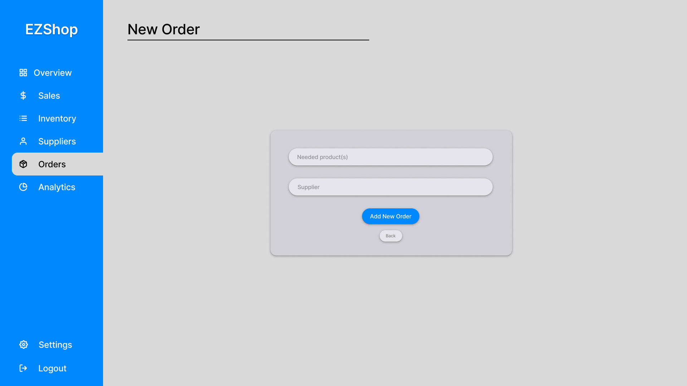

## Analytics

The `analytics` tab contains notable data and a chart about the shop earnings. The end user can select which time frame to analyze, the past month is selected by default 

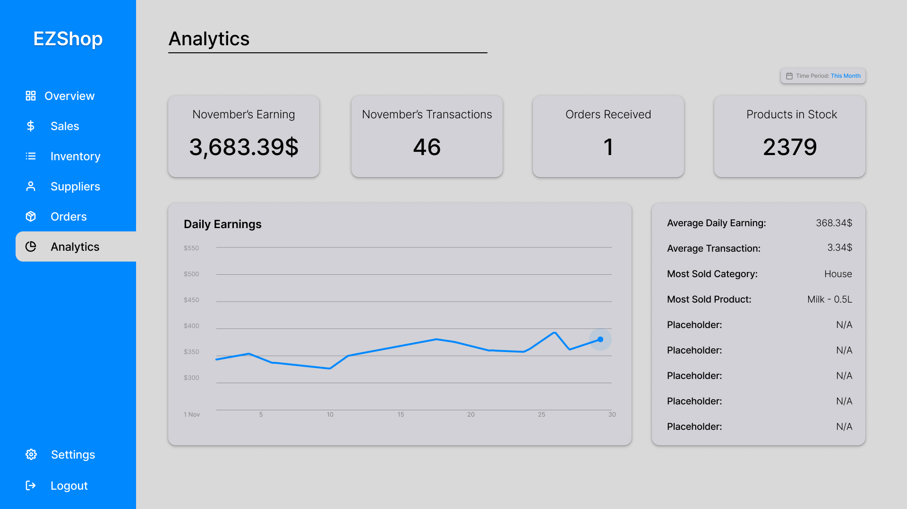
