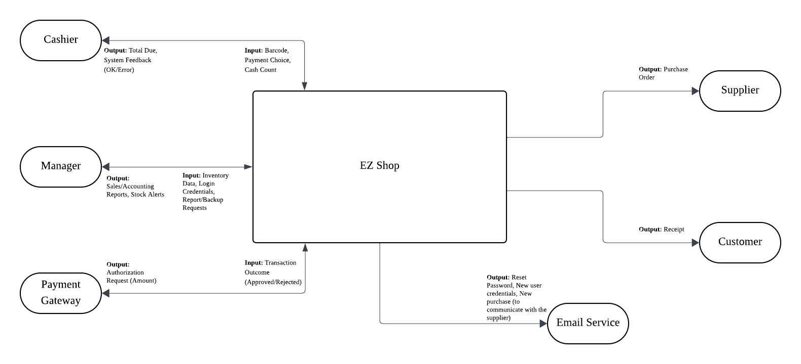
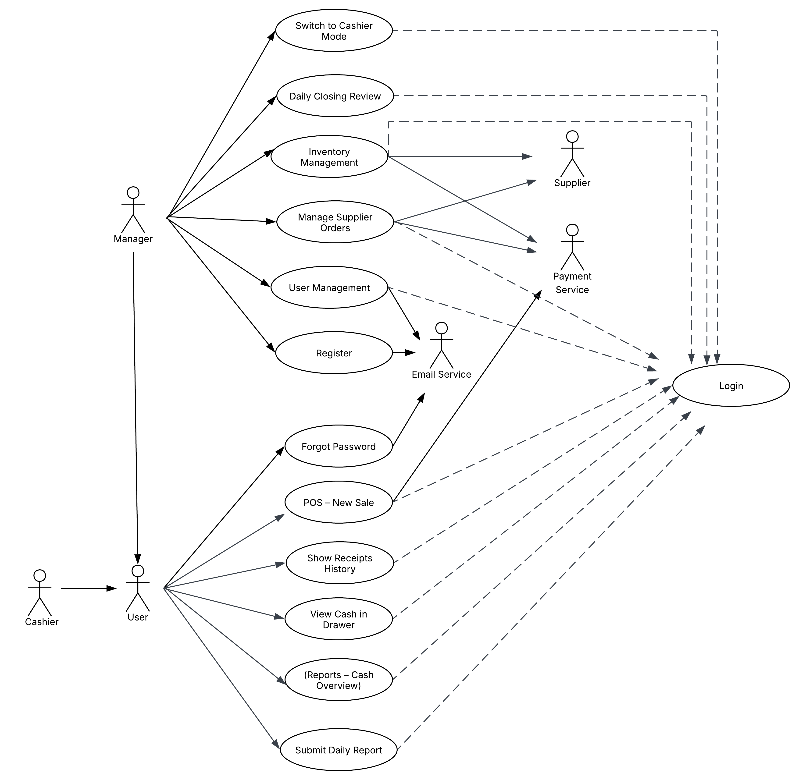
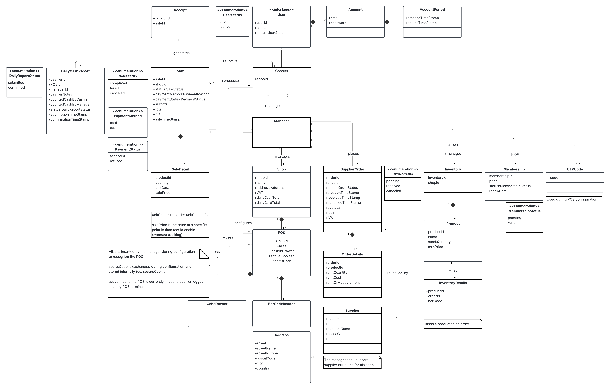
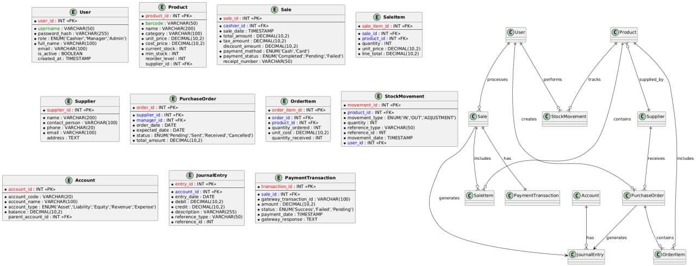
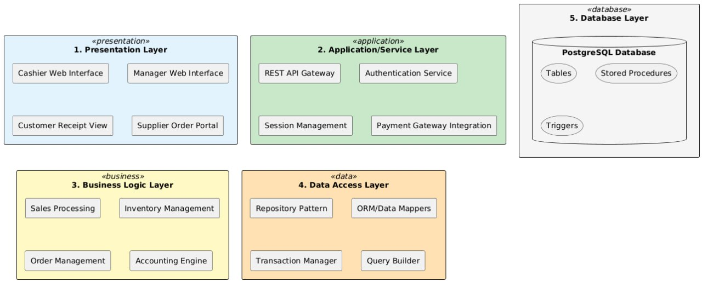
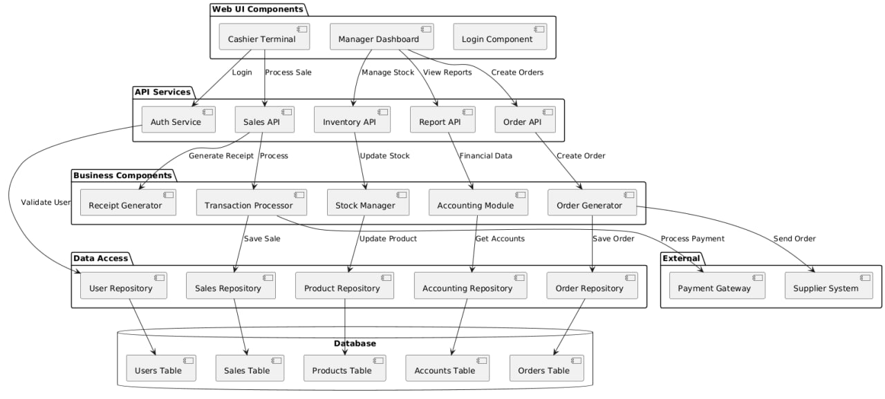
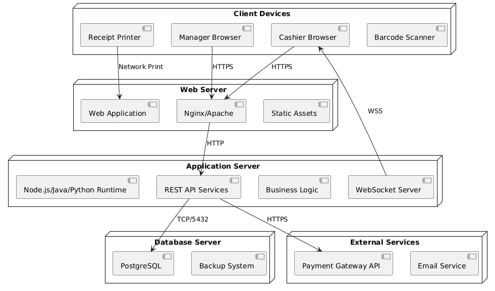

# Requirements Document - EZShop

**Date**: 24/10/2025  
**Version**: 1.0.0

## Version History
| Version | Change | Date | Author |
|---------|--------|------|--------|
| 1.0.0 | Initial Release | 24/10/2025 | Development Team |

## Table of Contents
1. [Informal Description](#informal-description)
2. [Business Model](#business-model)
3. [Stakeholders](#stakeholders)
4. [Context Diagram and Interfaces](#context-diagram-and-interfaces)
5. [Functional Requirements](#functional-requirements)
6. [Non-Functional Requirements](#non-functional-requirements)  
7. [Table of Rights](#table-of-rights)
8. [Use Cases](#use-cases)
9. [Glossary](#glossary)
10. [System Design](#system-design)
11. [Hardware Software Architecture](#hardware-software-architecture)

 
## Informal Description

Small shops require a simple application to support the owner or manager. A small shop (ex a food shop) occupies 50-200 square meters, sells 500-2000 different item types, has two or a few more cash registers. 

EZShop is a software application to:
- Manage sales
- Manage inventory  
- Manage orders to suppliers
- Support accounting

The application is designed as a web-based system accessible from multiple devices, with specialized interfaces for different user roles.

## Business Model

### Licensing & Revenue Share

EzShop offers a hybrid licensing model combining both a royalty-based option and fixed seat-license packages, giving customers flexibility as their business scales:

1. **Royalty-based option**: 
   - Shops pay 5% of gross revenue after exceeding revenue thresholds
   - Aligns our success with customer growth
   - Ideal for high-growth businesses

2. **Fixed seat-license packages**: 
   - Small shops: 1 manager seat + up to 5 cashier seats
   - Medium shops: 2 manager seats + up to 10 cashier seats
   - Large shops: Custom bundles based on requirements
   - Enterprise: Negotiated packages for complex operations

This approach ensures EzShop supports both high-growth businesses (via royalty) and established operations (via fixed licensing), while securing a recurring revenue stream that is both scalable and aligned with customer success.

## Stakeholders

| Stakeholder | Description |
|------------|-------------|
| **Manager** | Commissioner, Administrator and User of the system. They rely on the system to monitor sales performance, manage inventory levels, handle accounting tasks, and supervise cashier operations. |
| **Cashiers** | Operational users who interact with the system daily to process sales transactions, handle customer payments, and manage cash drawers. |
| **Customers** | Indirect users who purchase goods and receive official fiscal receipts. They interact with the system through the cashier interface. |
| **Payment System Provider** | External system - The financial partner responsible for securely processing and managing electronic transactions by credit cards. |
| **Email Service Provider** | External system - Provides the necessary service for system functions such as password reset links and the dispatch of supplier orders. |
| **Suppliers** | External partners who receive the purchase orders generated by the Manager and deliver products to the shop. |
| **Tax Agency** | Affected entity - An external regulatory body concerned with accurate fiscal reporting and precise VAT calculations. |
| **Accountant** | Affected professional - External professional who processes the shop's fiscal obligations. They do not use the system directly but rely on accurate reports exported by the Manager. |
| **Development Team** | The technical team responsible for designing, building, and maintaining the application. |

## Context Diagram and Interfaces

### Context Diagram


The context diagram shows EZShop as the central system with the following actors:
- **Cashier**: Inputs barcode, payment choice, cash count; Outputs total due, system feedback (OK/Error)
- **Manager**: Inputs inventory data, login credentials, report/backup requests; Outputs sales/accounting reports, stock alerts
- **Supplier**: Receives purchase orders from the system
- **Customer**: Receives receipts after completing purchases
- **Payment Gateway**: Inputs transaction outcome (Approved/Rejected); Outputs authorization request (Amount)

### Interfaces

| Actor | Logical Interface | Physical Interface |
|-------|------------------|-------------------|
| **Manager** | GUI Dashboard with tabs for Sales, Inventory, Accounting, Reports, Export Functions | PC Workstation with Mouse & Keyboard |
| **Cashier** | GUI POS Interface with operational buttons and system messages | POS Terminal with Touchscreen, Barcode Reader, Cash Drawer |
| **Payment Gateway** | Transactional API (REST/JSON) | Network Connection (HTTPS) |
| **Email System** | SMTP Protocol / Email API | Network Connection |
| **Customer** | Receipt Data (Items, Prices, Total, VAT), Transaction Amount | Receipt Printer, Card Terminal (Pin Pad) |
| **Supplier** | Purchase Order Document (PDF format) | Network Connection via Email Server |

## Functional Requirements

| ID | Description |
|----|-------------|
| **FR1** | **Manage User Account** - Enable users to login, logout, request password reset, and register new accounts (manager only) |
| **FR2** | **Manage Users** - Create, read, update, and delete user accounts with role assignment |
| **FR3** | **Manage Inventory** - View stock levels, adjust quantities, track product expiry dates, set reorder points |
| **FR4** | **Manage Supplier Orders** - Create purchase orders, submit to suppliers, track order status, receive goods |
| **FR5** | **Process Sales (POS)** - Scan product barcodes, calculate totals with tax, apply discounts, process payments |
| **FR6** | **Manage Receipts** - View receipt history, search past transactions, reprint receipts |
| **FR7** | **View Cash in Drawer** - Monitor current cash drawer balance, track cash movements |
| **FR8** | **Submit Daily Report** - Create end-of-shift cash reconciliation report with discrepancy notes |
| **FR9** | **Daily Closing Review** - Approve cashier reports, reconcile accounts, finalize daily closing |
| **FR10** | **View Reports** - Access sales reports, financial statements, inventory reports, tax reports |
| **FR11** | **Switch to Cashier Mode** - Allow managers to operate as cashiers without logging out |
| **FR12** | **Cofigure POS terminal** - Allow manager to configure POS terminal using OTP code |

## Non-Functional Requirements


### Efficiency & Performance
| ID | Type | Description | Refers to |
|----|------|-------------|-----------|
| **NFR1** | Efficiency | The application must not use more than 15% of CPU resources for more than 5 consecutive seconds | Entire Application |
| **NFR2** | Performance | Product search must return results from 2000 products in < 1.0 seconds | POS New Sale |
| **NFR3** | Performance | Sale completion including inventory update must complete in < 1.5 seconds | POS, Inventory |
| **NFR4** | Performance | Daily Reports and POS dashboard must load in < 3.0 seconds | Reports, Dashboard |

### Usability
| ID | Type | Description | Refers to |
|----|------|-------------|-----------|
| **NFR5** | Usability | New cashier must complete first sale within 10 minutes without training | Cashier Flow, POS |
| **NFR6** | Usability | Manager must create new account in < 3 minutes | User Management |
| **NFR7** | Usability | User error rate for daily reports must not exceed 5% | Submit Daily Report |

### Reliability
| ID | Type | Description | Refers to |
|----|------|-------------|-----------|
| **NFR8** | Reliability | System must guarantee 99.9% availability during business hours | Entire Application |
| **NFR9** | Reliability | Mean Time To Recover (MTTR) must be < 45 seconds | Entire Application |
| **NFR10** | Reliability | Inventory updates must be 100% guaranteed with queuing for offline mode | POS, Inventory |
| **NFR11** | Reliability | 100% transactional consistency between Sale, SaleDetails, and POS update | Sales System |

### Security
| ID | Type | Description | Refers to |
|----|------|-------------|-----------|
| **NFR12** | Security | Manager-reserved functions must be 100% inaccessible to Cashier role | User Roles |
| **NFR13** | Security | Automatic logout after 10 minutes of inactivity | Session Management |
| **NFR14** | Security | Password reset links must be single-use and expire within 1 hour | Forgot Password |
| **NFR15** | Security | OTP codes should expire after 10 minutes | Configure POS |

### Portability
| ID | Type | Description | Refers to |
|----|------|-------------|-----------|
| **NFR16** | Portability | Manager Dashboard must work on latest Chrome and Firefox | Web Interface |
| **NFR17** | Portability | Cashier POS must work on Android 12+ and iOS 15+ | Mobile Interface |
| **NFR18** | Portability | POS interface must adapt to 10-13 inch tablet screens | Responsive Design |

### Maintainability
| ID | Type | Description | Refers to |
|----|------|-------------|-----------|
| **NFR19** | Maintainability | Critical defect fix must require < 4 person-hours | POS System |
| **NFR20** | Maintainability | Adding new field to screens must require < 8 person-hours | UI Components |

### Legislative & Compliance
| ID | Type | Description | Refers to |
|----|------|-------------|-----------|
| **NFR21** | Legislative | VAT calculations must follow tax rules with 2 decimal precision | Accounting, Sale |
| **NFR22** | Legislative | Fiscal records must be immutable with visible reversal transactions | Receipts, Audit |

### Privacy & Interoperability
| ID | Type | Description | Refers to |
|----|------|-------------|-----------|
| **NFR23** | Privacy | Passwords must use bcrypt hashing, never plain text | User Management |
| **NFR24** | Interoperability | Payment Gateway communication via secure HTTPS APIs | External Integration |
| **NFR25** | Interoperability | Export data in CSV and PDF formats | Reports, Accounting |

## Table of Rights

| ID | Function | Manager | Cashier | Justification |
|----|----------|---------|---------|---------------|
| FR1 | Manage User Account | **Y** | **Y*** | *Registration restricted to Manager, but both can login/reset password |
| FR2 | Manage Users | **Y** | **N** | Manager-only function per NFR12 |
| FR3 | Manage Inventory | **Y** | **N** | Strategic function reserved for Manager |
| FR4 | Manage Supplier Orders | **Y** | **N** | Manager-only function per NFR12 |
| FR5 | Process Sales (POS) | **Y** | **Y** | Core operational function for Cashiers |
| FR6 | Manage Receipts | **Y** | **Y** | Both need access to receipt history |
| FR7 | View Cash in Drawer | **Y** | **Y** | Both monitor cash for different purposes |
| FR8 | Submit Daily Report | **Y** | **Y** | Cashier submits at shift end |
| FR9 | Daily Closing Review | **Y** | **N** | Manager approval function only |
| FR10 | View Reports | **Y** | **N** | Business intelligence for Manager only |
| FR11 | Switch to Cashier Mode | **Y** | **N** | Manager can operate as Cashier |
| FR12 | Configure POS Terminal | **Y** | **N** | Manager can request OTP code for configuring a POS terminal |

## Use Cases

### Use Case Diagram


The use case diagram illustrates all system functionalities and their relationships:
- **Login** use case is central, required by all users (Manager, Cashier)
- **Manager** has access to all administrative functions including switching to Cashier mode
- **Cashier** has limited access to operational functions
- External actors (**Supplier**, **Payment Service**, **Email Service**) interact with specific use cases

### Use Case Brief

| UC Name | Goal | Description |
|---------|------|-------------|
| **UC1 - Login** | Authenticate user | Users enter credentials to access appropriate dashboard |
| **UC2 - Register** | Create user account | Manager creates new employee accounts with roles |
| **UC3 - Forgot Password** | Reset password | User requests password reset via email link |
| **UC4 - POS New Sale** | Process purchase | Cashier scans items, accepts payment, prints receipt |
| **UC5 - Show Receipts History** | View transactions | Display searchable list of past sales |
| **UC6 - View Cash in Drawer** | Check balance | Display current cash drawer amount |
| **UC7 - Submit Daily Report** | Close shift | Cashier reconciles cash and submits report |
| **UC8 - Daily Closing Review** | Approve closing | Manager reviews and approves daily reports |
| **UC9 - Switch to Cashier Mode** | Change interface | Manager switches to POS view |
| **UC10 - Inventory Management** | Manage stock | View/update product quantities and information |
| **UC11 - Manage Supplier Orders** | Order products | Create and send purchase orders |
| **UC12 - User Management** | Administer users | CRUD operations on user accounts |
| **UC13 - Reports Cash Overview** | View reports | Access financial and sales reports |

See RequirementsUseCases.pdf for full specifications

## Glossary


### Entity Relationship Diagram


The ERD shows the complete database schema with all entities and their relationships:
- Core entities: User, Product, Sale, Supplier, Customer
- Transaction entities: SaleItem, PurchaseOrder, OrderItem, StockMovement
- Accounting entities: Account, JournalEntry, PaymentTransaction
- All relationships properly defined with cardinality

### Domain Model - Core Entities

```
User
├── user_id: INT (Primary Key)
├── username: VARCHAR(50) 
├── password_hash: VARCHAR(255)
├── role: ENUM('Cashier','Manager','Admin')
├── full_name: VARCHAR(100)
└── is_active: BOOLEAN

Product  
├── product_id: INT (Primary Key)
├── barcode: VARCHAR(50) - Unique product identifier
├── name: VARCHAR(200) - Product display name
├── category: VARCHAR(100) - Product classification
├── unit_price: DECIMAL(10,2) - Selling price
├── cost_price: DECIMAL(10,2) - Purchase cost
├── current_stock: INT - Available quantity
├── min_stock: INT - Reorder point
└── supplier_id: INT (Foreign Key)

Sale
├── sale_id: INT (Primary Key)
├── cashier_id: INT (Foreign Key to User)
├── sale_date: TIMESTAMP
├── total_amount: DECIMAL(10,2)
├── tax_amount: DECIMAL(10,2)
├── payment_method: ENUM('Cash','Card')
├── payment_status: ENUM('Completed','Pending','Failed')
└── receipt_number: VARCHAR(50)

Supplier
├── supplier_id: INT (Primary Key)
├── name: VARCHAR(200)
├── contact_person: VARCHAR(100)
├── phone: VARCHAR(20)
├── email: VARCHAR(100)
└── address: TEXT

PurchaseOrder
├── order_id: INT (Primary Key)
├── supplier_id: INT (Foreign Key)
├── manager_id: INT (Foreign Key to User)
├── order_date: DATE
├── expected_date: DATE
├── status: ENUM('Pending','Sent','Received','Cancelled')
└── total_amount: DECIMAL(10,2)

Account (for Accounting)
├── account_id: INT (Primary Key)
├── account_code: VARCHAR(20)
├── account_name: VARCHAR(100)
├── account_type: ENUM('Asset','Liability','Equity','Revenue','Expense')
└── balance: DECIMAL(10,2)

JournalEntry
├── entry_id: INT (Primary Key)
├── account_id: INT (Foreign Key)
├── entry_date: DATE
├── debit: DECIMAL(10,2)
├── credit: DECIMAL(10,2)
├── description: VARCHAR(255)
└── reference_id: INT
```

### Business Terms

- **POS (Point of Sale)**: The checkout interface where sales transactions are processed
- **Barcode**: Unique product identifier scanned during checkout
- **Cash Drawer**: Physical storage for cash with electronic control
- **Receipt**: Fiscal document proving purchase transaction
- **Stock/Inventory**: Current quantity of products available for sale
- **Purchase Order**: Formal request to supplier for products
- **Daily Closing**: End-of-day reconciliation process
- **VAT**: Value Added Tax applied to sales
- **Double-entry Bookkeeping**: Accounting method where every transaction affects two accounts
- **General Ledger**: Main accounting record containing all transactions

## System Design

### Architecture Overview



The system follows a **5-Layer Web Architecture**:

```
┌─────────────────────────────────────────┐
│   1. PRESENTATION LAYER                  │
│   • Cashier Web Interface                │
│   • Manager Web Interface                │
│   • Customer Receipt View                │
│   • Supplier Order Portal                │
└─────────────────────────────────────────┘
                    ↓
┌─────────────────────────────────────────┐
│   2. APPLICATION/SERVICE LAYER           │
│   • REST API Gateway                     │
│   • Authentication Service               │
│   • Session Management                   │
│   • Payment Gateway Integration          │
└─────────────────────────────────────────┘
                    ↓
┌─────────────────────────────────────────┐
│   3. BUSINESS LOGIC LAYER                │
│   • Sales Processing                     │
│   • Inventory Management                 │
│   • Order Management                     │
│   • Accounting Engine                    │
└─────────────────────────────────────────┘
                    ↓
┌─────────────────────────────────────────┐
│   4. DATA ACCESS LAYER                   │
│   • Repository Pattern                   │
│   • ORM/Data Mappers                     │
│   • Transaction Manager                  │
│   • Query Builder                        │
└─────────────────────────────────────────┘
                    ↓
┌─────────────────────────────────────────┐
│   5. DATABASE LAYER                      │
│   • PostgreSQL Database                  │
│   • Tables, Stored Procedures, Triggers  │
└─────────────────────────────────────────┘
```

### Component Architecture



The component diagram shows the detailed system architecture with:
- **Web UI Components**: Cashier Terminal, Manager Dashboard, Login Component
- **API Services**: Auth Service, Sales API, Inventory API, Report API, Order API
- **Business Components**: Transaction Processor, Stock Manager, Accounting Module, Order Generator, Receipt Generator
- **Data Access Layer**: User Repository, Product Repository, Sales Repository, Accounting Repository, Order Repository
- **Database Tables**: Users, Products, Sales, Accounts, Orders
- **External Integrations**: Payment Gateway, Supplier System
- All connections and dependencies clearly defined with proper interfaces

### Key Design Decisions

1. **Web-Based Architecture**: Accessible from any device with a browser
2. **Responsive Design**: Adapts to desktop and tablet screens
3. **Real-time Updates**: WebSocket connections for live inventory and sales updates
4. **Integrated Accounting**: Built-in double-entry bookkeeping system
5. **Offline Capability**: Local caching and queuing for network interruptions
6. **Role-Based Access Control**: Strict separation of Manager and Cashier functions

## Hardware Software Architecture

### Deployment Architecture



The deployment diagram illustrates the physical architecture:
- **Client Devices**: Browsers (Cashier & Manager), barcode scanners, receipt printers
- **Web Server**: Nginx/Apache with web application and static assets
- **Application Server**: Runtime environment (Node.js/Java/Python) with REST APIs and WebSocket
- **Database Server**: PostgreSQL with backup system
- **External Services**: Payment Gateway API and Email Service
- All connections use appropriate protocols (HTTPS, TCP/5432, WSS)

```
Client Devices
├── Cashier Browser (Tablet/Desktop)
├── Manager Browser (Desktop)
├── Barcode Scanner (USB/Bluetooth)
├── Receipt Printer (Network)
└── Cash Drawer (Serial/USB)
        ↓
Web Server (Nginx/Apache)
├── Static Assets
├── Web Application
└── Load Balancer
        ↓
Application Server
├── Node.js/Java/Python Runtime
├── REST API Services
├── WebSocket Server
└── Business Logic Components
        ↓
Database Server
├── PostgreSQL Primary
├── Backup System
└── Replication (optional)
        ↓
External Services
├── Payment Gateway API (HTTPS)
└── Email Service (SMTP)
```

### Technology Stack

- **Frontend**: HTML5, CSS3, JavaScript (React/Vue/Angular)
- **Backend**: Node.js/Java Spring/Python Django
- **Database**: PostgreSQL 13+
- **API**: RESTful with JSON, WebSocket for real-time
- **Security**: HTTPS, JWT tokens, bcrypt hashing
- **Deployment**: Docker containers, Kubernetes orchestration

### Hardware Requirements

**Minimum Requirements per Terminal:**
- CPU: Dual-core 2.0 GHz
- RAM: 4GB
- Storage: 20GB SSD
- Network: 10 Mbps broadband
- Display: 10" touchscreen (1280x800)

**Server Requirements (up to 5 terminals):**
- CPU: Quad-core 3.0 GHz
- RAM: 16GB
- Storage: 500GB SSD
- Network: 100 Mbps
- Backup: Daily automated backups

### Integration Points

1. **Barcode Scanner**: Serial/USB HID interface
2. **Receipt Printer**: ESC/POS protocol over network
3. **Cash Drawer**: RJ11/USB trigger signal
4. **Card Terminal**: API integration with payment gateway
5. **Email Server**: SMTP for notifications
6. **Accounting Export**: CSV/PDF generation
