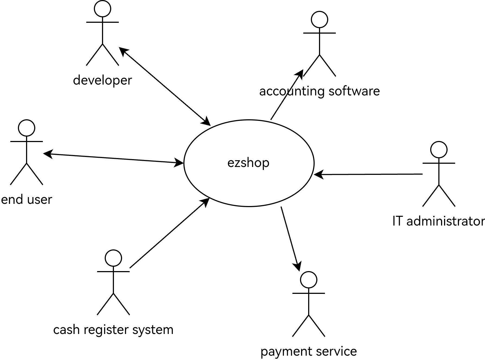

# Requirements Document - EZShop

Date: 24/10/2025

Version: 1.0.0

| Version number | Change |
| :------------: | :----: |
| 1.0.0 | Initial release |
| 2.0.0 | Added first drafts for business model, stakeholders, interfaces and FR| 

# Contents

- [Requirements Document - EzShop](#requirements-document)
- [Contents](#contents)
- [Informal description](#informal-description)
- [Business model](#business-model)
- [Stakeholders](#stakeholders)
- [Context Diagram and interfaces](#context-diagram-and-interfaces)
  - [Context Diagram](#context-diagram)
  - [Interfaces](#interfaces)
- [Functional and non functional requirements](#functional-and-non-functional-requirements)
  - [Functional Requirements](#functional-requirements)
  - [Non Functional Requirements](#non-functional-requirements)
- [Table of Rights](#table-of-rights)
- [Use case diagram and use cases](#use-case-diagram-and-use-cases)
  - [Use case diagram](#use-case-diagram)
    - [Use case 1, UC1](#use-case-1-uc1)
      - [Scenario 1.1](#scenario-11)
      - [Scenario 1.2](#scenario-12)
      - [Scenario 1.x](#scenario-1x)
    - [Use case 2, UC2](#use-case-2-uc2)
    - [Use case x, UCx](#use-case-x-ucx)
- [Glossary](#glossary)
- [System Design](#system-design)
- [Hardware Software architecture](#Hardware-software-architecture)

# Informal description

Small shops require a simple application to support the owner or manager. A small shop (ex a food shop) occupies 50-200 square meters, sells 500-2000 different item types, has two or a few more cash registers. 
EZShop is a software application to:
* manage sales
* manage inventory
* manage orders to suppliers
* support accounting

In the following describe the requirements of the EZShop application. 
You are free to define the application as you deem more useful and effective for the stakeholders. 
You are also free to modify the structure of the document when needed.
The document will be evaluated considering the typical defects in requirements (omissions, ambiguities, contradictions, etc), and syntactic errors in the formalism used (UML diagrams). 
Consider that the document should be delivered to another team (unknown to you)
 which will be in charge of designing and implementing the system. The design team should be able to proceed only with the information in the document.

# Business Model
EZShop will cost a monthly fee of x euros/month. The product won't contain advertising and will be inaccessible if the monthly fee is not paid for the current month

# Stakeholders

| Stakeholder name       | Description                                                                                      |
| :--------------------: | :----------------------------------------------------------------------------------------------: |
| Developers             | EZShop developers, in charge of developing and maintaining the product                           |
| Shop owner             | owner of the shop, who is the one choosing to adopt EZShop for his business                      |
| End user               | individual who directly interacts with the software, often a sale manager of some kind           |
| IT administrator       | he who manages the IT infrastructure of the shop and is in charge of locally deploying EZShop    |
| Cash register software | responsible for exchanging data with EzShop to record product sales                              |
| Payment service        | used **only**  to pay the monthly fee                                                            |
| Accounting software    | possible other software present in the business with whom EZShop will need to interact           |

# Context Diagram and interfaces

## Context Diagram

## Interfaces

\<describe here each interface in the context diagram>
|   Actor   | Logical Interface | Physical Interface |
| :-------: | :---------------: | :----------------: |
| End user |  EZShop GUI  | laptop or desktop |
| Cash register software | register software APIs | internet connection |
| Payment service | credit card circuit | internete connection |
| Accounting software | standardized product data exhange APIs | internet connection |
# Functional and non functional requirements

## Functional Requirements

\<In the form DO SOMETHING, or VERB NOUN, describe high level capabilities of the system>

\<they match to high level use cases>

|  ID   | Description |
| :---: | :---------: |
|FR1: Manage sales  | 1.1 Insert, read, update, delete sales records|
|                   | 1.2 Refund a product.|
|FR2: Manage inventory  | 2.1 Insert, read, update, delete inventory records
|                       | 2.2 Notification when stock is low|
|FR3: Manage orders to suppliers | 3.1 Insert, read, update, delete inventory records|
|                                | 3.2 Managing communications with suppliers |
|                                | 3.3 EZShop is able to send email to a specified email address|
|                                | 3.4 Automatically insert a record for an order when email is sent|
|FR4: Data visualization| 4.1 Sisplay charts overview about stored data|
|| 4.2 Filtering by category, time sold etc|
|| 4.3 Computes profits, expenses, taxes|
|| 4.4 Real time sync with database tables|
|FR5: Authentication and autorization process| 5.1 Login with email and password|
||5.1 Check if a subscription is active;
||5.2 Prompt to pay the subscription if it is not active;
|FR6: Exchange data with other software products|6.1 EZShop is able to access a local network to exchange data with other devices|
|| 6.2 Usage of an already established format to exchange standardized product data between software components|

## Non Functional Requirements

\<Describe constraints on functional requirements>

|   ID    | Type (efficiency, reliability, ..) | Description | Refers to |
| :-----: | :--------------------------------: | :---------: | :-------: |
|  NFR1   |                                    |             |           |
|  NFR2   |                                    |             |           |
|  NFR3   |                                    |             |           |
| NFRx .. |                                    |             |           |

# Table of rights

|  Actor   | FR1         | FRx |
| :---:    | :---------: | :---: |
|          |             |       |

# Use case diagram and use cases

## Use case brief
|  UC name   | Goal         | Description |
| :---:    | :---------: | :---: |
|          |             |       |

## Use case diagram

\<define here UML Use case diagram UCD summarizing all use cases, and their relationships>

\<next describe here each use case in the UCD>

### Use case 1, UC1

| Actors Involved  |                                                                      |
| :--------------: | :------------------------------------------------------------------: |
|   Precondition   | \<Boolean expression, must evaluate to true before the UC can start> |
|  Post condition  |  \<Boolean expression, must evaluate to true after UC is finished>   |
| Nominal Scenario |         \<Textual description of actions executed by the UC>         |
|     Variants     |                      \<other normal executions>                      |
|    Exceptions    |                        \<exceptions, errors >                        |

##### Scenario 1.1

\<describe here scenarios instances of UC1>

\<a scenario is a sequence of steps that corresponds to a particular execution of one use case>

\<a scenario is a more formal description of a story>

\<only relevant scenarios should be described>

|  Scenario 1.1  |                                                                            |
| :------------: | :------------------------------------------------------------------------: |
|  Precondition  | \<Boolean expression, must evaluate to true before the scenario can start> |
| Post condition |  \<Boolean expression, must evaluate to true after scenario is finished>   |

Steps

|     Actor's action      |  System action                                                                    | FR needed |
| :------------: | :------------------------------------------------------------------------: |:---:|
|               |                                                                 |  |
|   |  |  |
##### Scenario 1.2

##### Scenario 1.x

### Use case 2, UC2

..

### Use case x, UCx

..

# Glossary

\<use UML class diagram to define important terms, or concepts in the domain of the application, and their relationships>

\<concepts must be used consistently all over the document, ex in use cases, requirements etc>

# System Design

\<describe here system design>

\<must be consistent with Context diagram>

# Hardware Software architecture

\<describe here the hardware software architecture using UML deployment diagram >
