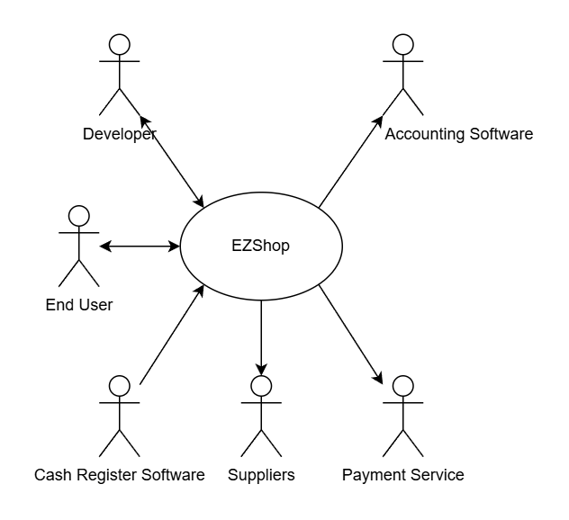
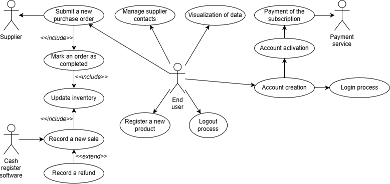

# Requirements Document - EZShop

Date: 24/10/2025

Version: 1.0.0

| Version number | Change |
| :------------: | :----: |
| 1.0.0 | Initial release |
| 2.0.0 | Added first drafts for business model, stakeholders, interfaces and FR| 

# Contents

- [Requirements Document - EzShop](#requirements-document)
- [Contents](#contents)
- [Informal description](#informal-description)
- [Business model](#business-model)
- [Stakeholders](#stakeholders)
- [Context Diagram and interfaces](#context-diagram-and-interfaces)
  - [Context Diagram](#context-diagram)
  - [Interfaces](#interfaces)
- [Functional and non functional requirements](#functional-and-non-functional-requirements)
  - [Functional Requirements](#functional-requirements)
  - [Non Functional Requirements](#non-functional-requirements)
- [Table of Rights](#table-of-rights)
- [Use case diagram and use cases](#use-case-diagram-and-use-cases)
  - [Use case diagram](#use-case-diagram)
    - [Use case 1, UC1](#use-case-1-uc1)
      - [Scenario 1.1](#scenario-11)
      - [Scenario 1.2](#scenario-12)
      - [Scenario 1.x](#scenario-1x)
    - [Use case 2, UC2](#use-case-2-uc2)
    - [Use case x, UCx](#use-case-x-ucx)
- [Glossary](#glossary)
- [System Design](#system-design)
- [Hardware Software architecture](#Hardware-software-architecture)

# Informal description

Small shops require a simple application to support the owner or manager. A small shop (ex a food shop) occupies 50-200 square meters, sells 500-2000 different item types, has two or a few more cash registers. 
EZShop is a software application to:
* manage sales
* manage inventory
* manage orders to suppliers
* support accounting

In the following describe the requirements of the EZShop application. 
You are free to define the application as you deem more useful and effective for the stakeholders. 
You are also free to modify the structure of the document when needed.
The document will be evaluated considering the typical defects in requirements (omissions, ambiguities, contradictions, etc), and syntactic errors in the formalism used (UML diagrams). 
Consider that the document should be delivered to another team (unknown to you)
 which will be in charge of designing and implementing the system. The design team should be able to proceed only with the information in the document.

# Business Model
EZShop will cost a monthly fee of x euros/month. The product won't contain advertising and will be inaccessible if the monthly fee is not paid for the current month

# Stakeholders

| Stakeholder name       | Description                                                                                      |
| :--------------------: | :----------------------------------------------------------------------------------------------: |
| Developers             | EZShop developers, in charge of developing and maintaining the product                           |
| Shop owner             | owner of the shop, who is the one choosing to adopt EZShop for his business                      |
| End user               | individual who directly interacts with the software, often a sale manager of some kind           |
| Supplier               | company who supplies the shop with products of various nature                                    |
| Cashier                | Employee of the shop who operates the Point of Sale (POS)                                        |
| Cash register software | responsible for exchanging data with EzShop to record product sales                              |
| Payment service        | used **only**  to pay the monthly fee                                                            |
| Accounting software    | possible other software present in the business with whom EZShop will need to interact           |

#TODO is differentiating shop owner and end user actually useful in the case od a small shop?

# Context Diagram and interfaces

## Context Diagram

## Interfaces

\<describe here each interface in the context diagram>
|   Actor   | Logical Interface | Physical Interface |
| :-------: | :---------------: | :----------------: |
| End user               |        EZShop GUI      | laptop or desktop computer (display, keyboard, mouse)   |
| Cash register software (Sqaure POS) | RESTful API (or similar, e.g., GraphQL) exchanging JSON | internet connection (WAN) |
| Payment service        | Payment gateway's API or a secure, hosted payment webpage | internet connection (HTTPS) |
| Accounting software    | file-based export/import (e.g., CSV or XML format). | internet connection |
# Functional and non functional requirements

## Functional Requirements

\<In the form DO SOMETHING, or VERB NOUN, describe high level capabilities of the system>

\<they match to high level use cases>

|  ID   | Description |
| :---: | :---------: |
|FR1: Manage sales               | 1.1 Insert, read, update, delete sales records |
|                                | 1.2 Refund a product |
|FR2: Manage inventory           | 2.1 Insert, read, update, delete inventory records |
|                                | 2.2 Notification when stock is low |
|FR3: Manage orders to suppliers | 3.1 Insert, read, update, delete suppliers contacts |
|                                | 3.2 Create a new purchase order from a given supplier, specifying products and amounts |
|                                | 3.3 EZShop is able to send email to a supplier after the creation of a new order |
|                                | 3.4 Automatically insert a record for an order when email is sent |
|                                | 3.5 Function to mark an order as completed and adding received products to inventory table |
|FR4: Data visualization         | 4.1 Display charts overview about stored data |
|                                | 4.2 Filtering by category, time range, etc |
|                                | 4.3 Computes profits, expenses, taxes |
|                                | 4.4 Real time sync with database tables |
|FR5: Authentication and autorization process| 5.1 Login with email and password |
|                                            | 5.2 Logout |
|                                            | 5.2 Check if a subscription is active |
|                                            | 5.3 Prompt to pay the subscription if it is not active |
|                                            | 5.4 Create a new account for a shop |
|FR6: Exchange data with other software products| 6.1 Connect to the internet (via HTTPS) to exchange data with external cloud-based services (e.g., POS system, payment services) |
|                                | 6.2 Usage of an already established format to exchange standardized product data between software components |

## Non Functional Requirements

\<Describe constraints on functional requirements>

|   ID    | Type (efficiency, reliability, ..) | Description | Refers to |
| :-----: | :--------------------------------: | :---------: | :-------: |
|  NFR1   | Portability                        | The application is targeting desktop platforms and to reduce porting work, a cross platform framework will be used to support Windows, Mac Os and Linux environments |        |
|  NFR2   | Performance                        | Query return time should be less than 3 seconds |           |
|  NFR3   | Performance                        | Synchronization with local tables should happen every minute and should take less than 5 seconds |           |
|  NFR4   | Maintainability                    | Codebase should be structured in distinct modules that can be easily maintained and updated |           |
|  NFR5   | Security                           | Each account needs to have 2FA enabled | FR5 |
|  NFR6   | Usability                          | Adult between 18 and 70 years old accustomed to using desktop softwares, average education level (ex total 13 years in school). Users should be able to use application without training in less than 5 minutes|  |

# Table of rights

|  Actor   | FR1         | FR2 | FR3 | FR4 | FR5 | FR6 |
| :---:    | :---------: | :---: | :---: | :---: | :---: | :---: |
| end user | y | y | y | y | n | n |
#TODO ask if we have to add each FR

# Use case diagram and use cases

## Use case brief
|  UC name   | Goal         | Description |
| :---:    | :---------: | :---: |
| UC1 Account creation | Activate a new account for a shop | main actor: end user - The end user inserts the requested credentials in the EZShop account database |
| UC2 Payment of the subscription | Activate the subscription for the selected account | main actor: shop owner, payment service - Thanks to a credit card circuit, the shop owner is able to (automatically) pay the monthly fee |
| UC3 Account activation | Having access to EZShop | main actor: end user - after paying the subscription fee through the payment service, the end user can use every features of application |
| UC4 Login process | Access to main functions | main actor: end user - With a given pair of credentials the end user can login to EZShop and start using it |
| UC5 Logout process | Sign out from the currently signed in account | main actor: end user - the user is able to log out and lose access to EZShop features |
| UC6 Register a new product | Registration of a product that is being sold at the shop | main actor: end user, cash register - A new product can be inserted in the product database both manually (by the end user) and automatically at the time of sale thanks to the ability to exchange data with the cash register system |
| UC7 Record a new sale | Record a sale | main actor: end user, cash register - A new sale can be inserted in the sale database both manually (by the end user) and automatically thanks to the ability to exchange data with the cash register system |
| UC8 Record a refund | Record a refund | main actor: end user, cash register - A customer can decide to ask for a refund of a previously sold product. This operation can be both managed by the cash register system as well as the end user |
| UC9 Manage supplier contacts | Create and keep supplier information up to date | main actor: end user - The end user can add, edit, or delete supplier contact details. Supplier data is stored in a dedicated database table for use when creating purchase orders |
| UC10 Submit a new purchase order | Generate a new purchase order to restock items | main actor: end user, supplier - The end user selects a supplier and specifies the products and quantities needed. The system generates a purchase order document and stores it in the database. The system automatically sends an email to the supplier |
| UC11 Mark an order as completed | End the order procedure | main actor: end user - when one order is delivered, the end user marks it as completed |
| UC12 Update inventory | Update inventory | main actor: end user - end user can change manually the amounts of products in stock |
| UC13 Visualization of data | Show charts, aggregating data | main actor: end user - end user can filter the data as desired |

## Use case diagram

\<define here UML Use case diagram UCD summarizing all use cases, and their relationships>

\<next describe here each use case in the UCD>

### Use case 1, UC1

| Actors Involved  |                                                                      |
| :--------------: | :------------------------------------------------------------------: |
|   Precondition   | \<Boolean expression, must evaluate to true before the UC can start> |
|  Post condition  |  \<Boolean expression, must evaluate to true after UC is finished>   |
| Nominal Scenario |         \<Textual description of actions executed by the UC>         |
|     Variants     |                      \<other normal executions>                      |
|    Exceptions    |                        \<exceptions, errors >                        |

##### Scenario 1.1

\<describe here scenarios instances of UC1>

\<a scenario is a sequence of steps that corresponds to a particular execution of one use case>

\<a scenario is a more formal description of a story>

\<only relevant scenarios should be described>

|  Scenario 1.1  |                                                                            |
| :------------: | :------------------------------------------------------------------------: |
|  Precondition  | \<Boolean expression, must evaluate to true before the scenario can start> |
| Post condition |  \<Boolean expression, must evaluate to true after scenario is finished>   |

Steps

|     Actor's action      |  System action                                                                    | FR needed |
| :------------: | :------------------------------------------------------------------------: |:---:|
|               |                                                                 |  |
|   |  |  |
##### Scenario 1.2

##### Scenario 1.x

### Use case 2, UC2

..

### Use case x, UCx

..

# Glossary

\<use UML class diagram to define important terms, or concepts in the domain of the application, and their relationships>

\<concepts must be used consistently all over the document, ex in use cases, requirements etc>

# System Design

\<describe here system design>

\<must be consistent with Context diagram>

# Hardware Software architecture

\<describe here the hardware software architecture using UML deployment diagram >
