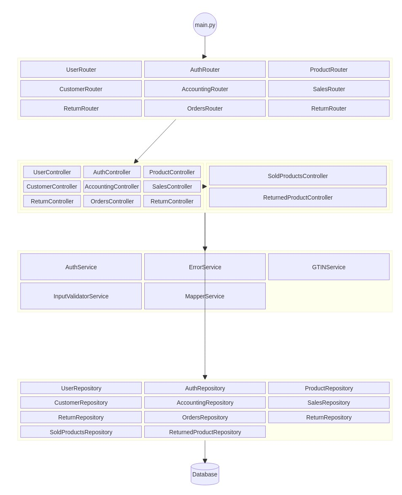
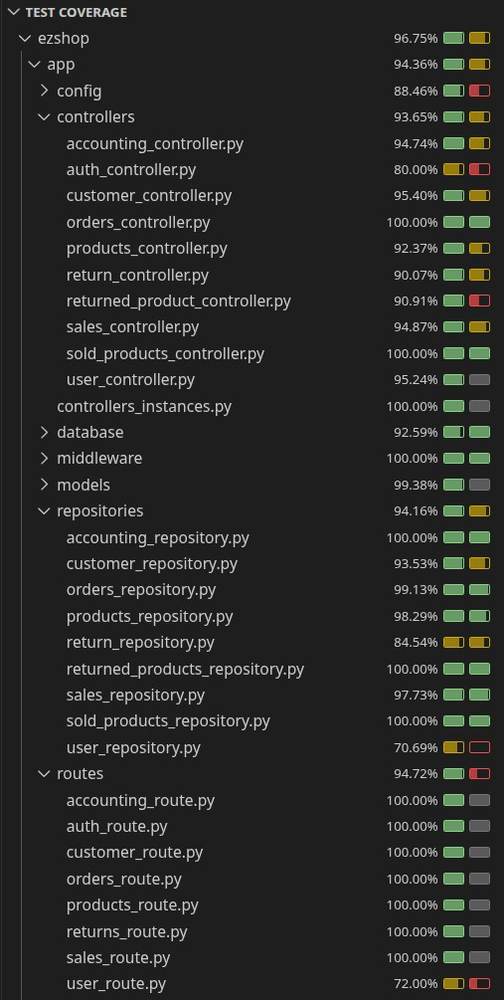

# Test Report

# Contents

- [Test Report](#test-report)
- [Contents](#contents)
- [Dependency graph](#dependency-graph)
- [Integration approach](#integration-approach)
- [Tests](#tests)
- [Coverage](#coverage)
  - [Coverage of FR](#coverage-of-fr)
  - [Coverage white box](#coverage-white-box)

# Dependency graph

# Integration approach

A bottom-up approach has been used, starting from running unit-tests for the various repositories. We then wrote integration tests for controller, using real repository objects. Finally, the last tests written were e2e tests on available routes to check the whole application flow. 

# Tests

## Unit Testing

### ProductRepository

| Test case name                 | Object(s) tested                             | Test level | Technique used                                           |
|:-------------------------------|:---------------------------------------------|:----------:|:---------------------------------------------------------|
| test_create_product            | ProductsRepository.create_product            |  Unit      | WB / Statement Coverage                                  |
| test_list_products             | ProductsRepository.list_products             |  Unit      | WB / Statement Coverage                                  |
| test_get_product               | ProductsRepository.get_product               |  Unit      | WB / Statement Coverage                                  |
| test_get_product_by_barcode    | ProductsRepository.get_product_by_barcode    |  Unit      | WB / Statement Coverage                                  |
| test_get_product_by_description| ProductsRepository.get_product_by_description|  Unit      | WB / Statement Coverage                                  |
| test_update_product_position   | ProductsRepository.update_product_position   |  Unit      | WB / Statement Coverage                                  |
| test_update_product_quantity   | ProductsRepository.update_product_quantity   |  Unit      | WB / Statement Coverage                                  |
| test_update_product            | ProductsRepository.update_product            |  Unit      | WB / Statement Coverage                                  |
| test_delete_product            | ProductsRepository.delete_product            |  Unit      | WB / Statement Coverage                                  |

### OrderRepository

| Test case name               | Object(s) tested                       | Test level | Technique used                                           |
|:-----------------------------|:-------------------------------------- |:----------:|:---------------------------------------------------------|
| test_create_order            | OrdersRepository.create_order          |  Unit      | WB / Statement Coverage                                 |
| test_list_orders             | OrdersRepository.list_orders           |  Unit      | WB / Boundary                                           |
| test_get_order               | OrdersRepository.get_order             |  Unit      | WB / Boundary                                           |
| test_pay_order               | OrdersRepository.pay_order             |  Unit      | WB / Decision Coverage                                  |
| test_record_arrival          | OrdersRepository.record_arrival        |  Unit      | WB / Decision Coverage                                  |
| test_create_and_pay_order    | OrdersRepository.create_and_pay_order  |  Unit      | WB / Statement Coverage                                 |
| test_get_orders_by_barcode   | OrdersRepository.get_orders_by_barcode |  Unit      | WB / Statement Coverage                                 |

### CustomerRepository

| Test case name               | Object(s) tested                       | Test level | Technique used                                           |
|:-----------------------------|:-------------------------------------- |:----------:|:---------------------------------------------------------|
| test_create_customer         | CustomerRepository.create_customer          |  Unit      | WB / Statement Coverage |
| test_create_customer_with_card_already_attached         | CustomerRepository.create_customer          |  Unit      | WB / Decision Coverage                            |
| test_list_customer             | CustomerRepository.list_customer           |  Unit      | WB / Statement Coverage                                           |
| test_list_customer_empty             | CustomerRepository.list_customer           |  Unit      | WB / Decision Coverage |
| test_get_customer               | CustomerRepository.get_customer             |  Unit      | WB / Decision Coverage                                              |
| test_update_customer_with_card_success               | CustomerRepository.update_customer             |  Unit      | WB / Statement Coverage   |
| test_update_customer_card_not_found        | CustomerRepository.update_customer             |  Unit      | WB / Decision Coverage   |
| test_update_customer_card_already_attached               | CustomerRepository.update_customer             |  Unit      | WB / Decision Coverage   |
| test_update_customer_not_found               | CustomerRepository.update_customer             |  Unit      | WB / Decision Coverage   |
| test_update_customer_only_name             | CustomerRepository.update_customer_only_name             |  Unit      | WB / Decision Coverage                                |
| test_delete_customer_success          | CustomerRepository.delete_customer        |  Unit      | WB / Statement Coverage                                  |
|test_delete_customer_not_found          | CustomerRepository.delete_customer        |  Unit      | WB / Decision Coverage                                |
| test_create_card     | CustomerRepository.create_card  |  Unit      | WB / Boundary Coverage |
| test_attach_card_success   | CustomerRepository.attach_card |  Unit      | WB / Statement Coverage |
| test_attach_card_card_not_found   | CustomerRepository.attach_card |  Unit      | WB / Decision Coverage |
| test_attach_card_customer_not_found   | CustomerRepository.attach_card |  Unit      | WB / Decision Coverage |
| test_attach_card_already_attached   | CustomerRepository.attach_card |  Unit      | WB / Decision Coverage |
| test_modify_point   | CustomerRepository.modify_point |  Unit      | WB / Statement Coverage                                 |
| test_modify_point_card_not_found   | CustomerRepository.modify_point |  Unit      | WB / Decision Coverage                                 |
| test_get_card_by_id_success   | CustomerRepository.get_card_by_id |  Unit      | WB / Statement Coverage                                 |
| test_get_card_by_id_not_found   | CustomerRepository.get_card_by_id |  Unit      | WB / Decision Coverage                                 |

### SaleRepository
| Test case name               | Object(s) tested                       | Test level | Technique used                                           |
|:-----------------------------|:-------------------------------------- |:----------:|:---------------------------------------------------------|
| test_create_sale_ok         | SaleRepository.create_sale          |  Unit      | WB / Statement Coverage | 
| test_list_sales_full         | SaleRepository.list_sales          |  Unit      | WB / Statement Coverage | 
| test_list_sales_empty         | SaleRepository.list_sales          |  Unit      | WB / Statement Coverage | 
| test_get_sale_by_id_ok  | SaleRepository.get_sale_by_id          |  Unit      | WB / Statement Coverage | 
| test_get_sale_by_id_not_found | SaleRepository.get_sale_by_id          |  Unit      | WB / Statement Coverage | 
| test_get_delete_sale_ok    | SaleRepository.delete_sale          |  Unit      | WB / Statement Coverage | 
| test_get_delete_sale_not_found   | SaleRepository.delete_sale          |  Unit      | WB / Statement Coverage | 
| test_edit_sale_discount_ok         | SaleRepository.edit_sale_discount          |  Unit      | WB / Statement Coverage | 
| test_edit_sale_discount_not_found         | SaleRepository.edit_sale_discount          |  Unit      | WB / Statement Coverage | 
| test_edit_sale_discount_invalid_status   | SaleRepository.edit_sale_discount          |  Unit      | WB / Statement Coverage | 
| test_edit_sale_status_pending         | SaleRepository.edit_sale_status          |  Unit      | WB / Statement Coverage | 
| test_edit_sale_status_pay     | SaleRepository.edit_sale_status       |  Unit      | WB / Statement Coverage |
| test_edit_sale_status_invalid_status    | SaleRepository.edit_sale_status  |  Unit      | WB / Statement Coverage | 

### SoldProductRepository
| Test case name               | Object(s) tested                       | Test level | Technique used                                           |
|:-----------------------------|:-------------------------------------- |:----------:|:---------------------------------------------------------|
| test_create_sold_product_ok         | SoldProductsRepository.create_sold_product          |  Unit      | WB / Statement Coverage | 
| test_create_sold_product_conflict         | SoldProductsRepository.create_sold_product |  Unit      | WB / Statement Coverage | 
| test_get_sale_by_id_ok         | SoldProductsRepository.get_sold_product_by_id          |  Unit      | WB / Statement Coverage | 
| test_get_sale_by_id_not_found  | SoldProductsRepository.get_sold_product_by_id          |  Unit      | WB / Statement Coverage | 
| test_edit_quantity_ok | SoldProductsRepository.edit_sold_product_quantity          |  Unit      | WB / Statement Coverage | 
| test_edit_quantity_not_found    | SoldProductsRepository.edit_sold_product_quantity         |  Unit      | WB / Statement Coverage | 
| test_edit_quantity_big_quantity   | SoldProductsRepository.edit_sold_product_quantity          |  Unit      | WB / Statement Coverage | 
| test_edit_discount_ok         | SoldProductsRepository.edit_sold_product_discount         |  Unit      | WB / Statement Coverage | 
| test_edit_discount_not_found         | SoldProductsRepository.edit_sold_product_discount          |  Unit      | WB / Statement Coverage | 
| test_remove_ok   | SoldProductsRepository.remove_sold_product          |  Unit      | WB / Statement Coverage | 

### ReturnRepository

| Test case name                                        | Object(s) tested                              | Test level | Technique used                    |
|:------------------------------------------------------|:----------------------------------------------|:----------:|:----------------------------------|
| test_create_return_transaction                        | ReturnRepository.create_return_transaction    |  Unit      | WB / Statement Coverage           |
| test_list_returns_with_results                        | ReturnRepository.list_returns                 |  Unit      | WB / Statement Coverage           |
| test_list_returns_empty_raises_not_found              | ReturnRepository.list_returns                 |  Unit      | WB / Decision Coverage            |
| test_get_return_by_id_success                         | ReturnRepository.get_return_by_id             |  Unit      | WB / Statement Coverage           |
| test_get_return_by_id_not_found                       | ReturnRepository.get_return_by_id             |  Unit      | WB / Decision Coverage            |
| test_delete_return_success                            | ReturnRepository.delete_return                |  Unit      | WB / Statement Coverage           |
| test_delete_return_not_found                          | ReturnRepository.delete_return                |  Unit      | WB / Decision Coverage            |
| test_list_returns_for_sale_id_success                 | ReturnRepository.list_returns_for_sale_id     |  Unit      | WB / Statement Coverage           |
| test_close_return_transaction_not_found               | ReturnRepository.close_return_transaction     |  Unit      | WB / Decision Coverage            |
| test_reimburse_return_not_closed_raises_invalid_state | ReturnRepository.reimburse_return_transaction |  Unit      | WB / Decision Coverage            |
| test_reimburse_return_not_found                       | ReturnRepository.reimburse_return_transaction |  Unit      | WB / Decision Coverage            |

### ReturnedProductsRepository

| Test case name                             | Object(s) tested                                                 | Test level | Technique used          |
|:-------------------------------------------|:-----------------------------------------------------------------|:----------:|:------------------------|
| test_create_returned_product               | ReturnedProductsRepository.create_returned_product               |  Unit      | WB / Statement Coverage |
| test_create_returned_product_duplicate     | ReturnedProductsRepository.create_returned_product               |  Unit      | WB / Decision Coverage  |
| test_edit_quantity_decrease                | ReturnedProductsRepository.edit_quantity_of_returned_product     |  Unit      | WB / Statement Coverage |
| test_edit_quantity_to_zero                 | ReturnedProductsRepository.edit_quantity_of_returned_product     |  Unit      | WB / Decision Coverage  |
| test_edit_quantity_not_found               | ReturnedProductsRepository.edit_quantity_of_returned_product     |  Unit      | WB / Decision Coverage  |
| test_edit_quantity_insufficient            | ReturnedProductsRepository.edit_quantity_of_returned_product     |  Unit      | WB / Decision Coverage  |
| test_get_by_id                             | ReturnedProductsRepository.get_returned_products_by_id           |  Unit      | WB / Statement Coverage |
| test_get_by_id_not_found                   | ReturnedProductsRepository.get_returned_products_by_id           |  Unit      | WB / Decision Coverage  |
| test_get_returned_products_by_barcode      | ReturnedProductsRepository.get_returned_product_by_barcode       |  Unit      | WB / Decision Coverage  |

## Integration Testing

### ProductsController

|         Test case name            | Object(s) tested                                |   Test level   |         Technique used                                  |
|:--------------------------------: |:----------------------------------------------: |:--------------:|:--------------------------------------------------------|
| test_create_product               | ProductsController.create_product               |  Integration   | BB / Equivalence Partitioning                           |
| test_list_products                | ProductsController.list_products                |  Integration   | BB / Equivalence Partitioning                           |
| test_get_product                  | ProductsController.get_product                  |  Integration   | BB / Equivalence Partitioning                           |
| test_get_product_by_barcode       | ProductsController.get_product_by_barcode       |  Integration   | BB / Equivalence Partitioning                           |
| test_get_product_by_description   | ProductsController.get_product_by_description   |  Integration   | BB / Equivalence Partitioning                           |
| test_update_product_position      | ProductsController.update_product_position      |  Integration   | BB / Equivalence Partitioning                           |
| test_update_product_quantity      | ProductsController.update_product_quantity      |  Integration   | BB / Equivalence Partitioning                           |
| test_update_product               | ProductsController.update_product               |  Integration   | BB / Equivalence Partitioning                           |
| test_update_product_invalid_state | ProductsController.update_product               |  Integration   | BB / Equivalence Partitioning                           |
| test_delete_product               | ProductsController.delete_product               |  Integration   | BB / Equivalence Partitioning                           |
| test_delete_product_invalid_sttate| ProductsController.delete_product               |  Integration   | BB / Equivalence Partitioning                           |

### AccountingController

|         Test case name            | Object(s) tested                                |   Test level   |         Technique used                                  |
|:--------------------------------: |:----------------------------------------------: |:--------------:|:--------------------------------------------------------|
| test_get_balance                  | AccountingController.get_balance                |   Integration  | BB / Equivalence Partitioning                           |
| test_set_balance                  | AccountingController.set_balance                |   Integration  | BB / Equivalence Partitioning                           |
| test_reset_balance                | AccountingController.reset_balance              |   Integration  | BB / Equivalence Partitioning                           |

### OrdersController

|         Test case name            | Object(s) tested                                |   Test level   |         Technique used                                  |
|:--------------------------------: |:----------------------------------------------: |:--------------:|:--------------------------------------------------------|
| test_create_order                 | OrdersController.create_order                   |   Integration  | BB / Equivalence Partitioning / Boundary                |
| test_list_orders                  | OrdersController.list_orders                    |   Integration  | WB / Statement Coverage                                 |
| test_pay_order                    | OrdersController.pay_order                      |   Integration  | BB / Equivalence Partitioning                           |
| test_record_arrival               | OrdersController.record_arrival                 |   Integration  | BB / Equivalence Partitioning                           |
| test_get_order_by_product_barcode | OrdersController.get_order_by_product_barcode   |   Integration  | BB / Equivalence Partitioning                           |

### CustomerController

|         Test case name            | Object(s) tested                                |   Test level   |         Technique used                                  |
|:--------------------------------: |:----------------------------------------------: |:--------------:|:--------------------------------------------------------|
| test_create_customer               | CustomerController.create_customer               |  Integration   | BB / Equivalence Partitioning                           |
| test_list_customers                | CustomerController.list_customer                |  Integration   | BB / Equivalence Partitioning                           |
| test_get_customer_by_id                  | CustomerController.get_customer                  |  Integration   | BB / Equivalence Partitioning / Boundary                           |
| test_update_customer       | CustomerController.update_customer       |  Integration   | BB / Equivalence Partitioning                           |
| test_update_customer_detach_card       | CustomerController.update_customer       |  Integration   | BB /   Boundary                           |
| test_update_customer_with_card_already_attached       | CustomerController.update_customer       |  Integration   | BB / Equivalence Partitioning                           |
| test_delete_customer   | CustomerController.delete_customer   |  Integration   | BB / Equivalence Partitioning                           |
| test_create_card      | CustomerController.create_card      |  Integration   | BB / Boundary                           |
| test_attach_card      | CustomerController.attach_card      |  Integration   | BB / Equivalence Partitioning / Boundary                            |
| test_modify_point               | CustomerController.modify_point               |  Integration   | BB / Equivalence Partitioning / Boundary                           |

### SaleController
|         Test case name            | Object(s) tested                                |   Test level   |         Technique used                                  |
|:--------------------------------: |:----------------------------------------------: |:--------------:|:--------------------------------------------------------|
| test_create_sale_controller_ok               | SaleController.create_sale               |  Integration   | BB / Equivalence Partitioning                           |
| test_get_all_sale_controller_ok               | SaleController.list_sales               |  Integration   | BB / Equivalence Partitioning
| test_get_sale_controller_ok               | SaleController.get_sale_by_id               |  Integration   | BB / Equivalence Partitioning
| test_get_sale_controller_invalid_input               | SaleController.get_sale_by_id               |  Integration   | BB / Equivalence Partitioning
| test_get_sale_controller_not_found               | SaleController.get_sale_by_id               |  Integration   | BB / Equivalence Partitioning
| test_delete_sale_controller_ok               | SaleController.delete_sale               |  Integration   | BB / Equivalence Partitioning
| test_delete_sale_controller_invalid_input               | SaleController.delete_sale               |  Integration   | BB / Equivalence Partitioning
| test_delete_sale_controller_not_found               | SaleController.delete_sale               |  Integration   | BB / Equivalence Partitioning
| test_delete_sale_controller_invalid_status               | SaleController.delete_sale               |  Integration   | BB / Equivalence Partitioning
| test_add_product_ok               | SaleController.attach_product               |  Integration   | BB / Equivalence Partitioning
| test_add_product_controller_invalid_input               | SaleController.attach_product               |  Integration   | BB / Equivalence Partitioning
| test_add_product_controller_not_found               | SaleController.attach_product               |  Integration   | BB / Equivalence Partitioning
| test_add_product_controller_invalid_status               | SaleController.attach_product               |  Integration   | BB / Equivalence Partitioning
| test_edit_product_controller_ok               | SaleController.edit_sold_product_quantity               |  Integration   | BB / Equivalence Partitioning
| test_edit_product_controller_invalid_input               | SaleController.edit_sold_product_quantity               |  Integration   | BB / Equivalence Partitioning
| test_edit_product_controller_not_found               | SaleController.edit_sold_product_quantity               |  Integration   | BB / Equivalence Partitioning
Partitioning
| test_edit_sale_discount_controller_ok               | SaleController.edit_sale_discount               |  Integration   | BB / Equivalence Partitioning
| test_edit_sale_discount_controller_invalid_inputt              | SaleController.edit_sale_discount               |  Integration   | BB / Equivalence Partitioning
| test_edit_sale_discount_controller_not_found             | SaleController.edit_sale_discount               |  Integration   | BB / Equivalence Partitioning
| test_edit_sale_discount_controller_invalid_status              | SaleController.edit_sale_discount               |  Integration   | BB / Equivalence Partitioning
| test_edit_sale_discount_controller_ok               | SaleController.edit_product_discount            |  Integration   | BB / Equivalence Partitioning
| test_edit_sale_discount_controller_invalid_inputt              | SaleController.edit_product_discount            |  Integration   | BB / Equivalence Partitioning
| test_edit_sale_discount_controller_not_found             | SaleController.edit_product_discount               |  Integration   | BB / Equivalence Partitioning
| test_edit_sale_discount_controller_invalid_status              | SaleController.edit_product_discount               |  Integration   | BB / Equivalence Partitioning
| test_close_sale_controller_ok               | SaleController.close_sale            |  Integration   | BB / Equivalence Partitioning
| test_close_sale_controller_invalid_inputt              | SaleController.close_sale            |  Integration   | BB / Equivalence Partitioning
| test_close_sale_controller_not_found             | SaleController.close_sale               |  Integration   | BB / Equivalence Partitioning
| test_close_sale_controller_invalid_status              | SaleController.close_sale               |  Integration   | BB / Equivalence Partitioning
| test_pay_sale_controller_ok               | SaleController.pay_sale            |  Integration   | BB / Equivalence Partitioning
| test_pay_sale_controller_invalid_inputt              | SaleController.pay_sale            |  Integration   | BB / Equivalence Partitioning
| test_pay_sale_controller_not_found             | SaleController.pay_sale               |  Integration   | BB / Equivalence Partitioning
| test_pay_sale_controller_invalid_status              | SaleController.pay_sale               |  Integration   | BB / Equivalence Partitioning
| test_get_point_controller_ok               | SaleController.get_points            |  Integration   | BB / Equivalence Partitioning
| test_get_point_controller_invalid_inputt              | SaleController.get_points            |  Integration   | BB / Equivalence Partitioning
| test_get_point_controller_not_found             | SaleController.get_points               |  Integration   | BB / Equivalence Partitioning
| test_get_point_controller_invalid_status              | SaleController.get_points               |  Integration   | BB / Equivalence Partitioning

### SoldProductsController
|         Test case name            | Object(s) tested                                |   Test level   |         Technique used                                  |
|:--------------------------------: |:----------------------------------------------: |:--------------:|:--------------------------------------------------------|
| test_create_sold_product_controller_ok           | SoldProductsController.create_sold_product               |  Integration   | BB / Equivalence Partitioning
| test_create_sold_product_controller_invalid_input           | SoldProductsController.create_sold_product               |  Integration   | BB / Equivalence Partitioning
| test_get_sold_product_by_id_controller_ok           | SoldProductsController.get_sold_product_by_id               |  Integration   | BB / Equivalence Partitioning
| test_get_sold_product_by_id_controller_invalid_input           | SoldProductsController.get_sold_product_by_id               |  Integration   | BB / Equivalence Partitioning
| test_get_sold_product_by_id_controller_not_found           | SoldProductsController.get_sold_product_by_id               |  Integration   | BB / Equivalence Partitioning
| test_edit_sold_product_quantity_controller_ok           | SoldProductsController.edit_sold_product_quantity               |  Integration   | BB / Equivalence Partitioning
| test_edit_sold_product_quantity_controller_invalid_input           | SoldProductsController.edit_sold_product_quantity               |  Integration   | BB / Equivalence Partitioning
| test_edit_sold_product_discount_controller_ok           | SoldProductsController.edit_sold_product_discount               |  Integration   | BB / Equivalence Partitioning
| test_edit_sold_product_discount_controller_invalid_input           | SoldProductsController.edit_sold_product_discount               |  Integration   | BB / Equivalence Partitioning
| test_remove_sold_product_ok           | SoldProductsController.remove_sold_product               |  Integration   | BB / Equivalence Partitioning
| test_remove_sold_product_invalid_input           | SoldProductsController.remove_sold_product               |  Integration   | BB / Equivalence Partitioning
### ReturnController

|         Test case name            | Object(s) tested                                |   Test level   |         Technique used                                  |
|:--------------------------------: |:----------------------------------------------: |:--------------:|:--------------------------------------------------------|
| test_create_return_transaction                 | ReturnController.create_return_transaction      |   Integration  | BB / Equivalence Partitioning                           |
| test_create_return_invalid_sale_id             | ReturnController.create_return_transaction      |   Integration  | BB / Equivalence Partitioning                           |
| test_create_return_negative_sale_id            | ReturnController.create_return_transaction      |   Integration  | BB / Boundary                                           |
| test_get_return_by_id_success                  | ReturnController.get_return_by_id               |   Integration  | BB / Equivalence Partitioning                           |
| test_get_return_by_id_not_found                | ReturnController.get_return_by_id               |   Integration  | BB / Equivalence Partitioning                           |
| test_get_return_by_id_invalid_id               | ReturnController.get_return_by_id               |   Integration  | BB / Boundary                                           |
| test_delete_return_success                     | ReturnController.delete_return                  |   Integration  | BB / Equivalence Partitioning                           |
| test_delete_return_not_found                   | ReturnController.delete_return                  |   Integration  | BB / Equivalence Partitioning                           |
| test_close_return_transaction_success          | ReturnController.close_return_transaction       |   Integration  | BB / Equivalence Partitioning                           |
| test_close_return_already_closed               | ReturnController.close_return_transaction       |   Integration  | BB / Equivalence Partitioning                           |
| test_close_return_not_found                    | ReturnController.close_return_transaction       |   Integration  | BB / Equivalence Partitioning                           |
| test_attach_product_to_return_success          | ReturnController.attach_product_to_return_transaction |   Integration  | BB / Equivalence Partitioning                     |
| test_attach_product_invalid_barcode            | ReturnController.attach_product_to_return_transaction |   Integration  | BB / Equivalence Partitioning                     |
| test_attach_product_negative_amount            | ReturnController.attach_product_to_return_transaction |   Integration  | BB / Boundary                                     |
| test_attach_product_to_closed_return           | ReturnController.attach_product_to_return_transaction |   Integration  | BB / Equivalence Partitioning                     |
| test_reimburse_return_not_closed               | ReturnController.reimburse_return_transaction   |   Integration  | BB / Equivalence Partitioning                           |
| test_reimburse_return_not_found                | ReturnController.reimburse_return_transaction   |   Integration  | BB / Equivalence Partitioning                           |
| test_list_returns_for_sale_id                  | ReturnController.list_returns_for_sale_id       |   Integration  | BB / Equivalence Partitioning                           |

### ReturnedProductController

|         Test case name            | Object(s) tested                                |   Test level   |         Technique used                                  |
|:--------------------------------: |:----------------------------------------------: |:--------------:|:--------------------------------------------------------|
| test_create_returned_product                   | ReturnedProductController.create_returned_product             |   Integration  | BB / Equivalence Partitioning         |
| test_create_returned_product_validation        | ReturnedProductController.create_returned_product             |   Integration  | BB / Boundary                         |
| test_create_returned_product_duplicate         | ReturnedProductController.create_returned_product             |   Integration  | BB / Equivalence Partitioning         |
| test_edit_quantity_decrease                    | ReturnedProductController.edit_quantity_of_returned_product   |   Integration  | BB / Equivalence Partitioning         |
| test_edit_quantity_to_zero_deletes             | ReturnedProductController.edit_quantity_of_returned_product   |   Integration  | BB / Boundary                         |
| test_edit_quantity_validation                  | ReturnedProductController.edit_quantity_of_returned_product   |   Integration  | BB / Boundary                         |
| test_edit_quantity_not_found                   | ReturnedProductController.edit_quantity_of_returned_product   |   Integration  | BB / Equivalence Partitioning         |
| test_edit_quantity_insufficient                | ReturnedProductController.edit_quantity_of_returned_product   |   Integration  | BB / Equivalence Partitioning         |
| test_get_by_id                                 | ReturnedProductController.get_returned_products_by_id         |   Integration  | BB / Equivalence Partitioning         |
| test_get_by_id_not_found                       | ReturnedProductController.get_returned_products_by_id         |   Integration  | BB / Equivalence Partitioning         |
| test_get_by_id_validation                      | ReturnedProductController.get_returned_products_by_id         |   Integration  | BB / Boundary                         |
| test_get_by_barcode                            | ReturnedProductController.get_returned_product_by_barcode     |   Integration  | BB / Equivalence Partitioning         |
| test_get_by_barcode_not_found                  | ReturnedProductController.get_returned_product_by_barcode     |   Integration  | BB / Equivalence Partitioning         |
| test_get_by_barcode_validation                 | ReturnedProductController.get_returned_product_by_barcode     |   Integration  | BB / Boundary                         |

## End to end Testing

### ProductsRouter

|         Test case name            | Object(s) tested                                |   Test level   |         Technique used                                  |
|:--------------------------------: |:----------------------------------------------: |:--------------:|:--------------------------------------------------------|
| test_create_product               | ProductsRouter.create_product                   |  End to End    | BB / Equivalence Partitioning                           |
| test_list_products                | ProductsRouter.list_products                    |  End to End    | BB / Equivalence Partitioning                           |
| test_get_product                  | ProductsRouter.get_product                      |  End to End    | BB / Equivalence Partitioning                           |
| test_get_product_by_barcode       | ProductsRouter.get_product_by_barcode           |  End to End    | BB / Equivalence Partitioning                           |
| test_get_product_by_description   | ProductsRouter.get_product_by_description       |  End to End    | BB / Equivalence Partitioning                           |
| test_update_product_position      | ProductsRouter.update_product_position          |  End to End    | BB / Equivalence Partitioning                           |
| test_update_product_quantity      | ProductsRouter.update_product_quantity          |  End to End    | BB / Equivalence Partitioning                           |
| test_update_product               | ProductsRouter.update_product                   |  End to End    | BB / Equivalence Partitioning                           |
| test_update_product_invalid_state | ProductsRouter.update_product                   |  End to End    | BB / Equivalence Partitioning                           |
| test_update_product_duplicates    | ProductsRouter.update_product                   |  End to End    | BB / Equivalence Partitioning                           |
| test_delete_product               | ProductsRouter.delete_product                   |  End to End    | BB / Equivalence Partitioning                           |
| test_delete_product_invalid_state | ProductsRouter.delete_product                   |  End to End    | BB / Equivalence Partitioning                           |

### AccountingRouter

| Test case name                     | Object(s) tested                       | Test level | Technique used                                          |
|:-----------------------------------|:---------------------------------------|:----------:|:--------------------------------------------------------|
| test_get_current_balance           | AccountingRouter.get_current_balance   | End to End | BB / Equivalence Partitioning                           |
| test_set_balance_authentication    | AccountingRouter.set_balance (auth)    | End to End | BB / Equivalence Partitioning                           |
| test_set_balance_authenticated     | AccountingRouter.set_balance           | End to End | BB / Boundary                                           |
| test_reset_balance_authentication  | AccountingRouter.reset_balance (auth)  | End to End | BB / Equivalence Partitioning                           |
| test_reset_balance_authenticated   | AccountingRouter.reset_balance         | End to End | BB / State-based                                        |

### OrdersRouter

| Test case name                     | Object(s) tested                       | Test level | Technique used                                          |
|:-----------------------------------|:---------------------------------------|:----------:|:--------------------------------------------------------|
| test_issue_order_authentication    | OrdersRouter.issue_order (auth)        | End to End | BB / Equivalence Partitioning                           |
| test_issue_order                   | OrdersRouter.issue_order               | End to End | BB / Equivalence Partitioning                           |
| test_pay_order_for_authentication  | OrdersRouter.pay_order_for (auth)      | End to End | BB / Equivalence Partitioning                           |
| test_pay_order_for                 | OrdersRouter.pay_order_for             | End to End | BB / Equivalence Partitioning                           |
| test_list_orders                   | OrdersRouter.list_orders               | End to End | BB / Equivalence Partitioning                           |
| test_pay_order_authentication      | OrdersRouter.pay_order                 | End to End | BB / Equivalence Partitioning                           |
| test_pay_order                     | OrdersRouter.pay_order (auth)          | End to End | BB / Equivalence Partitioning                           |
| test_record_arrival_authentication | OrdersRouter.record_arrival (auth)     | End to End | BB / Equivalence Partitioning                           |
| test_record_arrival                | OrdersRouter.record_arrival            | End to End | BB / Equivalence Partitioning                           |

### CustomerRouter

|         Test case name            | Object(s) tested                                |   Test level   |         Technique used                                  |
|:--------------------------------: |:----------------------------------------------: |:--------------:|:--------------------------------------------------------|
| test_create_customer               | CustomerRouter.create_customer                   |  End to End    | BB / Equivalence Partitioning                           |
| test_list_customers                | CustomerRouter.list_customer                    |  End to End    | BB / Equivalence Partitioning                           |
| test_get_customer                  | CustomerRouter.get_customer                      |  End to End    | BB / Equivalence Partitioning                           |
| test_update_customer       | CustomerRouter.update_customer           |  End to End    | BB / Equivalence Partitioning                           |
| test_delete_customer   | CustomerRouter.delete_customer       |  End to End    | BB / Equivalence Partitioning                           |
| test_delete_customer_with_card      | CustomerRouter.delete_customer          |  End to End    | BB / Equivalence Partitioning                           |
| test_create_card      | CustomerRouter.create_card          |  End to End    | BB / Equivalence Partitioning                           |
| test_attach_card               | CustomerRouter.attach_card                   |  End to End    | BB / Equivalence Partitioning                           |
| test_attach_card_already_attached               | CustomerRouter.attach_card                   |  End to End    | BB / Equivalence Partitioning                           |
| test_modify_points               | CustomerRouter.modify_point                   |  End to End    | BB / Equivalence Partitioning                           |

### SalesRoute
|         Test case name            | Object(s) tested                                |   Test level   |         Technique used                                  |
|:--------------------------------: |:----------------------------------------------: |:--------------:|:--------------------------------------------------------|
| test_close_sale_route_ok               | SaleRoute.close_sale                   |  End to End    | BB / Equivalence Partitioning                           |
| test_create_sale_route               | SaleRoute.create_sale                   |  End to End    | BB / Equivalence Partitioning                           |
| test_delete_sale_route               | SaleRoute.delete_sale                   |  End to End    | BB / Equivalence Partitioning                           |
| test_get_all_sale_route               | SaleRoute.list_sales                   |  End to End    | BB / Equivalence Partitioning                           |
| test_get_sale_id_route_ok               | SaleRoute.get_sale_by_id                   |  End to End    | BB / Equivalence Partitioning                           |
| test_paid_sale_route               | SaleRoute.pay_sale                   |  End to End    | BB / Equivalence Partitioning                           |
| test_points_sale_route_ok               | SaleRoute.get_sale_points                   |  End to End    | BB / Equivalence Partitioning                           |
| test_product_added_route               | SaleRoute.attach_product                   |  End to End    | BB / Equivalence Partitioning                           |
| test_remove_added_route_ok               | SaleRoute.edit_product_quantity                   |  End to End    | BB / Equivalence Partitioning                           |
| test_set_discount_product_route               | SaleRoute.edit_product_discount                  |  End to End    | BB / Equivalence Partitioning                           |
| test_set_discount_route               | SaleRoute.edit_sale_discount                  |  End to End    | BB / Equivalence Partitioning                           |
### ReturnsRouter

|         Test case name            | Object(s) tested                                |   Test level   |         Technique used                                  |
|:--------------------------------: |:----------------------------------------------: |:--------------:|:--------------------------------------------------------|
| test_create_return_transaction_authentication      | ReturnsRouter.create_return_transaction (auth)   |  End to End    | BB / Equivalence Partitioning                           |
| test_create_return_transaction_success             | ReturnsRouter.create_return_transaction          |  End to End    | BB / Equivalence Partitioning                           |
| test_create_return_transaction_invalid_sale        | ReturnsRouter.create_return_transaction          |  End to End    | BB / Equivalence Partitioning                           |
| test_create_return_transaction_unpaid_sale         | ReturnsRouter.create_return_transaction          |  End to End    | BB / Equivalence Partitioning                           |
| test_create_return_transaction_negative_sale_id    | ReturnsRouter.create_return_transaction          |  End to End    | BB / Boundary                                           |
| test_create_return_transaction_zero_sale_id        | ReturnsRouter.create_return_transaction          |  End to End    | BB / Boundary                                           |
| test_list_all_returns                              | ReturnsRouter.list_all_returns                   |  End to End    | BB / Equivalence Partitioning                           |
| test_get_return_by_id                              | ReturnsRouter.get_return_by_id                   |  End to End    | BB / Equivalence Partitioning / Boundary                |
| test_get_return_by_id_authentication               | ReturnsRouter.get_return_by_id (auth)            |  End to End    | BB / Equivalence Partitioning                           |
| test_list_returns_for_sale_id_success              | ReturnsRouter.list_returns_for_sale_id           |  End to End    | BB / Equivalence Partitioning                           |
| test_list_returns_for_sale_id_negative_id          | ReturnsRouter.list_returns_for_sale_id           |  End to End    | BB / Boundary                                           |
| test_list_returns_for_sale_id_zero_id              | ReturnsRouter.list_returns_for_sale_id           |  End to End    | BB / Boundary                                           |
| test_list_returns_for_sale_id_string_id            | ReturnsRouter.list_returns_for_sale_id           |  End to End    | BB / Equivalence Partitioning                           |
| test_list_returns_for_sale_id_authentication       | ReturnsRouter.list_returns_for_sale_id (auth)    |  End to End    | BB / Equivalence Partitioning                           |
| test_attach_product_to_return_success              | ReturnsRouter.attach_product_to_return           |  End to End    | BB / Equivalence Partitioning                           |
| test_attach_product_to_return_authentication       | ReturnsRouter.attach_product_to_return (auth)    |  End to End    | BB / Equivalence Partitioning                           |
| test_attach_product_to_return_product_not_found    | ReturnsRouter.attach_product_to_return           |  End to End    | BB / Equivalence Partitioning                           |
| test_attach_product_to_return_negative_return_id   | ReturnsRouter.attach_product_to_return           |  End to End    | BB / Boundary                                           |
| test_attach_product_to_return_string_return_id     | ReturnsRouter.attach_product_to_return           |  End to End    | BB / Equivalence Partitioning                           |
| test_attach_product_to_return_invalid_barcode_too_short | ReturnsRouter.attach_product_to_return      |  End to End    | BB / Boundary                                           |
| test_attach_product_to_return_invalid_barcode_with_letters | ReturnsRouter.attach_product_to_return  |  End to End    | BB / Equivalence Partitioning                           |
| test_attach_product_to_return_negative_amount      | ReturnsRouter.attach_product_to_return           |  End to End    | BB / Boundary                                           |
| test_attach_product_to_return_string_amount        | ReturnsRouter.attach_product_to_return           |  End to End    | BB / Equivalence Partitioning                           |
| test_attach_product_to_return_invalid_return_id    | ReturnsRouter.attach_product_to_return           |  End to End    | BB / Equivalence Partitioning                           |
| test_attach_product_to_closed_return               | ReturnsRouter.attach_product_to_return           |  End to End    | BB / Equivalence Partitioning                           |
| test_delete_product_from_return_success            | ReturnsRouter.delete_product_from_return         |  End to End    | BB / Equivalence Partitioning                           |
| test_delete_product_from_return_authentication     | ReturnsRouter.delete_product_from_return (auth)  |  End to End    | BB / Equivalence Partitioning                           |
| test_delete_product_from_return_negative_return_id | ReturnsRouter.delete_product_from_return         |  End to End    | BB / Boundary                                           |
| test_delete_product_from_return_string_return_id   | ReturnsRouter.delete_product_from_return         |  End to End    | BB / Equivalence Partitioning                           |
| test_delete_product_from_return_negative_amount    | ReturnsRouter.delete_product_from_return         |  End to End    | BB / Boundary                                           |
| test_delete_product_from_return_string_amount      | ReturnsRouter.delete_product_from_return         |  End to End    | BB / Equivalence Partitioning                           |
| test_delete_product_from_return_not_found          | ReturnsRouter.delete_product_from_return         |  End to End    | BB / Equivalence Partitioning                           |
| test_delete_product_from_return_product_not_found  | ReturnsRouter.delete_product_from_return         |  End to End    | BB / Equivalence Partitioning                           |
| test_delete_product_from_closed_return             | ReturnsRouter.delete_product_from_return         |  End to End    | BB / Equivalence Partitioning                           |
| test_delete_product_from_reimbursed_return         | ReturnsRouter.delete_product_from_return         |  End to End    | BB / Equivalence Partitioning                           |
| test_close_return_transaction_success              | ReturnsRouter.close_return_transaction           |  End to End    | BB / Equivalence Partitioning                           |
| test_close_return_transaction_authentication       | ReturnsRouter.close_return_transaction (auth)    |  End to End    | BB / Equivalence Partitioning                           |
| test_close_return_transaction_not_found            | ReturnsRouter.close_return_transaction           |  End to End    | BB / Equivalence Partitioning                           |
| test_close_return_transaction_negative_id          | ReturnsRouter.close_return_transaction           |  End to End    | BB / Boundary                                           |
| test_close_return_transaction_zero_id              | ReturnsRouter.close_return_transaction           |  End to End    | BB / Boundary                                           |
| test_close_return_transaction_string_id            | ReturnsRouter.close_return_transaction           |  End to End    | BB / Equivalence Partitioning                           |
| test_close_return_transaction_already_closed       | ReturnsRouter.close_return_transaction           |  End to End    | BB / Equivalence Partitioning                           |
| test_reimburse_return_transaction_success          | ReturnsRouter.reimburse_return_transaction       |  End to End    | BB / Equivalence Partitioning                           |
| test_reimburse_return_transaction_authentication   | ReturnsRouter.reimburse_return_transaction (auth)|  End to End    | BB / Equivalence Partitioning                           |
| test_reimburse_return_transaction_not_found        | ReturnsRouter.reimburse_return_transaction       |  End to End    | BB / Equivalence Partitioning                           |
| test_reimburse_return_transaction_negative_id      | ReturnsRouter.reimburse_return_transaction       |  End to End    | BB / Boundary                                           |
| test_reimburse_return_transaction_zero_id          | ReturnsRouter.reimburse_return_transaction       |  End to End    | BB / Boundary                                           |
| test_reimburse_return_transaction_string_id        | ReturnsRouter.reimburse_return_transaction       |  End to End    | BB / Equivalence Partitioning                           |
| test_reimburse_return_transaction_not_closed       | ReturnsRouter.reimburse_return_transaction       |  End to End    | BB / Equivalence Partitioning                           |
| test_delete_return_success                         | ReturnsRouter.delete_return                      |  End to End    | BB / Equivalence Partitioning                           |
| test_delete_return_authentication                  | ReturnsRouter.delete_return (auth)               |  End to End    | BB / Equivalence Partitioning                           |
| test_delete_return_not_found                       | ReturnsRouter.delete_return                      |  End to End    | BB / Equivalence Partitioning                           |
| test_delete_return_negative_id                     | ReturnsRouter.delete_return                      |  End to End    | BB / Boundary                                           |
| test_delete_return_zero_id                         | ReturnsRouter.delete_return                      |  End to End    | BB / Boundary                                           |
| test_delete_return_string_id                       | ReturnsRouter.delete_return                      |  End to End    | BB / Equivalence Partitioning                           |
| test_delete_closed_return                          | ReturnsRouter.delete_return                      |  End to End    | BB / Equivalence Partitioning                           |
| test_delete_reimbursed_return                      | ReturnsRouter.delete_return                      |  End to End    | BB / Equivalence Partitioning                           |

# Coverage

## Coverage of FR

| Functional Requirement or scenario |           Test(s)                   |
| :--------------------------------: | :----------------------------------:|
|                FR1                 |                                     |
|                FR1.1               |                                     |
|                FR1.2               |                                     |
|                FR1.3               |                                     |
|                FR1.4               |                                     |
|                FR1.5               |                                     |
|                FR3                 |                                     |
|                FR3.1               |test_create_product,test_update_product_position, test_update_product_quantity, test_update_product, test_update_product_invalid_state, test_update_product_duplicates|                                 
|                FR3.2               |       test_delete_product           |
|                FR3.3               |        test_list_products           |
|                FR3.4               |test_get_product, test_get_product_by_barcode, test_get_product_by_description   |
|                FR4                 |                                     |
|                FR4.1               |                                     |
|                FR4.2               |                                     |
|                FR4.3               |                                     |
|                FR4.4               |      test_pay_order_for (e2e)       |
|                FR4.5               |                                     |
|                FR4.6               |      test_record_arrival (e2e)      |
|                FR4.7               |       test_list_orders (e2e)        |
|                FR 5                |                                     |
|                FR5.1               |                                     |
|                FR5.2               |                                     |
|                FR5.3               |                                     |
|                FR5.4               |                                     |
|                FR5.5               |                                     |
|                FR5.6               |                                     | 
|                FR5.7               |                                     |
|                FR6                 |                                     |
|                FR6.1               | test_create_sale_route, test_create_sale_controller_ok,   test_create_sale_ok,test_create_return_transaction_success (e2e)                                   |
|                FR6.2               |      test_create_sold_product_ok, test_create_sold_product_conflict, test_add_product_ok,test_add_product_invalid_input,test_add_product_invalid_status, test_add_product_not_found, test_product_added_route,test_attach_product_to_return_success (e2e)                               |
|                FR6.3               |  test_remove_ok, test_remove_sold_product_ok, test_remove_sold_product_invalid_input, test_remove_product_route_ok,test_delete_product_from_return_success (e2e)                                    |
|                FR6.4               | test_set_discount,  test_edit_sale_discount_controller_ok,test_edit_sale_discount_controller_invalid_input, test_edit_sale_discount_controller_not_found, test_edit_sale_discount_controller_invalid_status,test_edit_sale_ok,test_edit_sale_discount_invalid_status, test_edit_sale_discount_not_found, test_close_return_transaction_success (e2e)                                    |
|                FR6.5               | test_set_discount_product_route, test_edit_product_discount_controllore_ok,test_edit_product_discount_controllore_invalid_input, test_edit_product_discount_controllore_invalid_status, test_edit_product_discount_controllore_not_found, test_edit_discount_ok,test_edit_discount_not_found,test_list_all_returns (e2e)                                   |
|                FR6.6               | test_get_point_controller_ok, test_get_point_controller_invalid_input, test_get_point_controller_invalid_status, test_get_point_controller_not_found, test_point_route_ok,test_get_return_by_id (e2e)                                   |
|                FR6.7               |   test_list_returns_for_sale_id_success (e2e)                                  |
|                FR6.8               | test_get_sale_id_route_ok, test_get_sale_controller_ok,test_get_sale_controller_invalid_input,test_get_sale_controller_not_found, test_get_sale_by_id_ok, test_get_sale_by_id_not_found, test_delete_return_success (e2e)                                    |
|                FR6.10              | test_edit_sale_status_pending, test_close_sale_controlle_ok,test_close_sale_controlle_not_found,test_close_sale_controlle_invalid_input,test_close_sale_controlle_invalid_status,test_close_sale_sale_route_ok,test_edit_sale_status_invalid_status,test_attach_product_to_return_success (e2e)                                     |
|                FR6.11              | test_delete_sale_route, test_paid_sale_route, test_delete_sale_controller_ok,test_delete_sale_controller_invalid_input,test_delete_sale_controller_not_found, test_delete_sale_controller_invalid_status,test_delete_paid_controller_invalid_input,test_paid_sale_controller_not_found, test_paid_sale_controller_invalid_status, test_paid_sale_controller_ok, test_delete_sale_ok, test_delete_sale_not_found, test_edit_sale_status_paid, test_edit_sale_status_invalid_status, test_delete_product_from_return_success (e2e)                                 |
|                FR6.12              |test_list_all_returns (e2e)                                      |
|                FR6.13              |  test_close_return_transaction_success (e2e)   |
|                FR6.14              |  test_delete_return_success (e2e)              |
|                FR6.15              |  test_reimburse_return_transaction_success (e2e) |
|                FR7                 |                                     |
|                FR7.1               |  test_reimburse_return_transaction_success (e2e) |
|                FR7.2               |  test_reimburse_return_transaction_success (e2e) |
|                FR7.3               |  test_reimburse_return_transaction_success (e2e) |
|                FR7.4               |  test_get_current_balance (e2e)                  |
|                FR8                 |                                     |
|                FR8.1               |test_set_balance_authenticated (e2e) |
|                FR8.2               |test_set_balance_authenticated (e2e) |
|                FR8.3               |   test_get_current_balance (e2e)    |
|                FR8.4               |test_set_balance_authenticated (e2e) |
|             Scenario 1-1           |    test_create_product              |
|             Scenario 1-2           |  test_update_product_position       |
|             Scenario 1-3           |    test_update_product              |
|             Scenario 2-1           |                                     |
|             Scenario 2-2           |                                     |
|             Scenario 2-3           |                                     |
|             Scenario 3-1           |       test_issue_order (e2e)        |
|             Scenario 3-2           |       test_pay_order (e2e)          |
|             Scenario 3-3           |      test_record_arrival (e2e)      |
|             Scenario 4-1           |      test_create_customer (e2e)     |
|             Scenario 4-2           |test_create_card, test_attach_card (e2e)|
|             Scenario 4-3           |      test_update_customer (e2e)     |
|             Scenario 4-4           |      test_update_customer (e2e)     |
|             Scenario 4-1           |                                     |
|             Scenario 5-1           |                                     |
|             Scenario 5-2           |                                     |
|             Scenario 6-1           |test_create_sale_route, test_product_added_route, test_remove_product_route_ok, test_close_sale_route_ok, test_close_paid_route                                       |
|             Scenario 6-2           |test_create_sale_route, test_product_added_route,test_remove_product_route_ok, test_close_sale_route_ok, test_close_paid_route, test_set_product_discount                                    |
|             Scenario 6-3           |test_create_sale_route, test_product_added_route,test_remove_product_route_ok, test_close_sale_route_ok, test_close_paid_route, test_set_sale_discount                                      |
|             Scenario 6-4           |test_create_sale_route, test_product_added_route,test_remove_product_route_ok, test_close_sale_route_ok, test_close_paid_route,test_points_route_ok                                     |
|             Scenario 6-5           | test_create_sale_route, test_product_added_route,test_remove_product_route_ok, test_close_sale_route_ok, test_close_paid_route, test_delete_sale_route                                    |
|             Scenario 6-6           |test_create_sale_route, test_product_added_route,test_remove_product_route_ok, test_close_sale_route_ok, test_close_paid_route,                                     |
|             Scenario 7-1           |                                      |
|             Scenario 7-2           |                                      |
|             Scenario 7-3           |                                      |
|             Scenario 7-4           |                                      |
|             Scenario 8-1           | test_create_return_transaction_authentication, test_create_return_transaction_success, test_attach_product_to_return_success, test_close_return_transaction_success, test_reimburse_return_transaction_success (e2e) |
|             Scenario 8-2           | test_create_return_transaction_authentication, test_create_return_transaction_success, test_attach_product_to_return_success, test_delete_product_from_return_success, test_close_return_transaction_success, test_reimburse_return_transaction_success (e2e) |
|             Scenario 9-1           |                                      |
|             Scenario 10-1          |                                      |
|             Scenario 10-2          |                                      |

## Coverage white box

Detailed test execution is the following:

- platform linux -- Python 3.13.11, pytest-9.0.2, pluggy-1.6.0
- rootdir: /home/User/ezshop
- configfile: pytest.ini
- plugins: cov-7.0.0, anyio-4.12.0, asyncio-1.3.0
- asyncio: mode=Mode.AUTO, debug=False, asyncio_default_fixture_loop_scope=None, asyncio_default_test_loop_scope=function
- collected 656 items

|Name                                                    |Stmts  | Miss | Cover |
| :----------------------------------------------------: | :----:| :--: | :---: |
|app/config/config.py                                    |   24  |    2 |  92%  |
|app/controllers/accounting_controller.py                |   15  |    0 | 100%  |
|app/controllers/auth_controller.py                      |   18  |    3 |  83%  |
|app/controllers/customer_controller.py                  |   69  |    2 |  97%  |
|app/controllers/orders_controller.py                    |   45  |    0 | 100%  |
|app/controllers/products_controller.py                  |  103  |    0 | 100%  |
|app/controllers/return_controller.py                    |  109  |    6 |  94%  |
|app/controllers/returned_product_controller.py          |   40  |    2 |  95%  |
|app/controllers/sales_controller.py                     |  147  |    5 |  97%  |
|app/controllers/sold_products_controller.py             |   47  |    0 | 100%  |
|app/controllers/user_controller.py                      |   21  |    1 |  95%  |
|app/controllers_instances.py                            |   16  |    0 | 100%  |
|app/database/database.py                                |   25  |    2 |  92%  |
|app/middleware/auth_middleware.py                       |   11  |    0 | 100%  |
|app/middleware/error_middleware.py                      |    7  |    0 | 100%  |
|app/models/DAO/__init__.py                              |    0  |    0 | 100%  |
|app/models/DAO/accounting_dao.py                        |    6  |    0 | 100%  |
|app/models/DAO/card_dao.py                              |    8  |    0 | 100%  |
|app/models/DAO/customer_dao.py                          |    9  |    0 | 100%  |
|app/models/DAO/order_dao.py                             |   10  |    0 | 100%  |
|app/models/DAO/product_dao.py                           |   11  |    0 | 100%  |
|app/models/DAO/return_transaction_dao.py                |   12  |    0 | 100%  |
|app/models/DAO/returned_product_dao.py                  |   11  |    0 | 100%  |
|app/models/DAO/sale_dao.py                              |   12  |    0 | 100%  |
|app/models/DAO/sold_product_dao.py                      |   12  |    0 | 100%  |
|app/models/DAO/system_dao.py                            |    6  |    0 | 100%  |
|app/models/DAO/user_dao.py                              |    9  |    0 | 100%  |
|app/models/DTO/boolean_response_dto.py                  |    3  |    0 | 100%  |
|app/models/DTO/card_dto.py                              |   14  |    0 | 100%  |
|app/models/DTO/change_response_dto.py                   |    3  |    0 | 100%  |
|app/models/DTO/customer_dto.py                          |   19  |    0 | 100%  |
|app/models/DTO/error_dto.py                             |    9  |    0 | 100%  |
|app/models/DTO/order_dto.py                             |   10  |    0 | 100%  |
|app/models/DTO/points_response_dto.py                   |    3  |    0 | 100%  |
|app/models/DTO/product_dto.py                           |   26  |    0 | 100%  |
|app/models/DTO/return_transaction_dto.py                |   13  |    0 | 100%  |
|app/models/DTO/returned_product_dto.py                  |    9  |    0 | 100%  |
|app/models/DTO/sale_dto.py                              |   12  |    0 | 100%  |
|app/models/DTO/sold_product_dto.py                      |    9  |    0 | 100%  |
|app/models/DTO/token_dto.py                             |    3  |    0 | 100%  |
|app/models/DTO/user_dto.py                              |   20  |    0 | 100%  |
|app/models/errors/app_error.py                          |    5  |    0 | 100%  |
|app/models/errors/bad_request.py                        |    5  |    0 | 100%  |
|app/models/errors/balance_error.py                      |    6  |    0 | 100%  |
|app/models/errors/conflict_error.py                     |    5  |    0 | 100%  |
|app/models/errors/customer_card_error.py                |    5  |    0 | 100%  |
|app/models/errors/insufficient_quantity_sold_error.py   |    5  |    2 |  60%  |
|app/models/errors/insufficient_stock_error.py           |    5  |    0 | 100%  |
|app/models/errors/invalid_state_error.py                |    5  |    0 | 100%  |
|app/models/errors/notfound_error.py                     |    5  |    0 | 100%  |
|app/models/errors/unauthorized_error.py                 |    5  |    0 | 100%  |
|app/models/return_status_type.py                        |    5  |    0 | 100%  |
|app/models/user_type.py                                 |    5  |    0 | 100%  |
|app/repositories/accounting_repository.py               |   35  |    0 | 100%  |
|app/repositories/customer_repository.py                 |  134  |    6 |  96%  |
|app/repositories/orders_repository.py                   |   93  |    0 | 100%  |
|app/repositories/products_repository.py                 |   95  |    0 | 100%  |
|app/repositories/return_repository.py                   |   85  |   16 |  81%  |
|app/repositories/returned_products_repository.py        |   56  |    0 | 100%  |
|app/repositories/sales_repository.py                    |   72  |    1 |  99%  |
|app/repositories/sold_products_repository.py            |   60  |    0 | 100%  |
|app/repositories/user_repository.py                     |   56  |   18 |  68%  |
|app/routes/accounting_route.py                          |   18  |    0 | 100%  |
|app/routes/auth_route.py                                |   10  |    0 | 100%  |
|app/routes/customer_route.py                            |   41  |    0 | 100%  |
|app/routes/orders_route.py                              |   25  |    0 | 100%  |
|app/routes/products_route.py                            |   38  |    0 | 100%  |
|app/routes/returns_route.py                             |   38  |    0 | 100%  |
|app/routes/sales_route.py                               |   45  |    0 | 100%  |
|app/routes/user_route.py                                |   40  |    8 |  80%  |
|app/services/auth_service.py                            |   36  |    6 |  83%  |
|app/services/error_service.py                           |   10  |    0 | 100%  |
|app/services/gtin_service.py                            |   16  |    0 | 100%  |
|app/services/input_validator_service.py                 |   37  |    3 |  92%  |
|app/services/mapper_service.py                          |   41  |    0 | 100%  |
|app/utils.py                                            |   17  |    1 |  94%  |
|TOTAL                                                   | 2115  |   84 |   96% |

=== 656 passed in 10.00s ===
